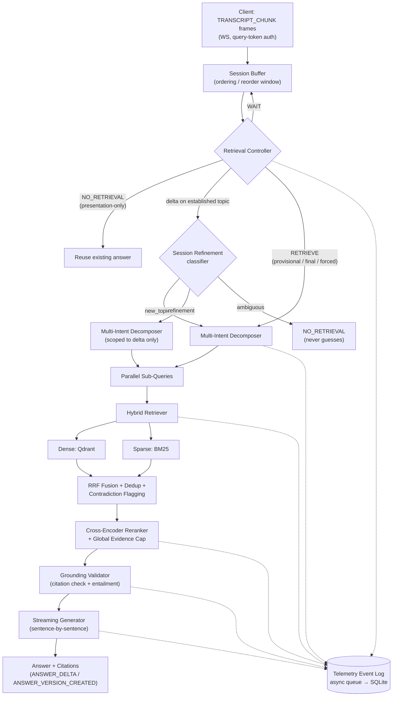

# Streaming Live RAG

A single FastAPI service that retrieves and answers while the user is still speaking — deciding per transcript chunk whether to retrieve, splitting compound requests into independent sub-queries, and refining an existing grounded answer in place when a later chunk adds a new constraint.

Built for the **Samsung PRISM Generative AI Hackathon 3rd Edition 2026–27, Theme 4: Streaming Live RAG**.

[](https://github.com/Prabh-84/streaming-rag/actions/workflows/ci.yml)


Full frozen specification: [`PRD_TRD.md`](PRD_TRD.md), [`docs/ARCHITECTURE.md`](docs/ARCHITECTURE.md), [`docs/API.md`](docs/API.md), [`docs/TELEMETRY.md`](docs/TELEMETRY.md), [`docs/EVALUATION.md`](docs/EVALUATION.md). This README documents what is **actually implemented and verified** in the current repository, not the aspirational spec.

## Table of Contents

- [Overview](#overview)
- [Why This Matters](#why-this-matters)
- [Key Capabilities](#key-capabilities)
- [System Architecture](#system-architecture)
- [Core Pipeline](#core-pipeline)
- [Handling Incremental / Late Information](#handling-incremental--late-information)
- [Multi-Intent Example](#multi-intent-example)
- [Grounding and Citation Safety](#grounding-and-citation-safety)
- [Corpus Isolation](#corpus-isolation)
- [Observability](#observability)
- [Evaluation](#evaluation)
- [Ablation Studies](#ablation-studies)
- [Performance / Metrics](#performance--metrics)
- [Tech Stack](#tech-stack)
- [Repository Structure](#repository-structure)
- [Quick Start](#quick-start)
- [API / WebSocket](#api--websocket)
- [Configuration](#configuration)
- [Testing](#testing)
- [Reproducibility](#reproducibility)
- [Design Decisions](#design-decisions)
- [Limitations](#limitations)
- [Security / Privacy](#security--privacy)
- [Hackathon Alignment](#hackathon-alignment)
- [Submission Checklist](#submission-checklist)
- [License](#license)

## Overview

Batch RAG waits for a complete utterance, treats every turn as fresh, and discards verified work the moment a user corrects themselves. That model breaks down in a live conversational setting: users speak incrementally, one utterance can carry several distinct questions, important constraints ("...for 30 guests" / "...specifically for the library, not the hostel") often arrive after the main request, and a system that restarts its whole pipeline on every such addition feels slow and forgetful.

Streaming Live RAG is one deterministic FastAPI process that retrieves while the user is still speaking when the transcript is stable and specific enough to justify it, decomposes a compound request into independently searchable sub-questions, retrieves and fuses evidence for each, and streams back a grounded answer whose every factual sentence is validated against a real corpus citation. A later chunk that adds a genuine new constraint to an already-established topic refines that answer with a delta-only retrieval, rather than re-running the full pipeline from scratch.

## Why This Matters

The engineering problem is not "do RAG" — it is deciding, under partial information, *when* to search, *how many* independent questions are actually being asked, and *what to keep* from prior work when the user isn't finished talking. Get retrieval timing wrong and you either search on every noisy half-sentence (wasted latency, garbage queries) or wait for a full stop and lose the latency advantage entirely. Get decomposition wrong and a compound question collapses into one over-broad query or fragments into near-duplicates. Get refinement wrong and every correction throws away already-verified evidence and citations.

This project's answer is a small set of deterministic, independently testable stages — not an LLM-driven agent loop deciding each of these things by prompt — so every decision is auditable from its own telemetry event, not inferred from generated text.

## Key Capabilities

| Capability | What it does |
|---|---|
| **Early Retrieval** | Retrieval can start before the transcript is marked final, once the last two chunks' embeddings are stable *and* a concrete corpus entity has been resolved — stability alone never fires it. |
| **Retrieval Controller** | Per-chunk `WAIT` / `RETRIEVE` / `NO_RETRIEVAL` decision machine, with a forced decision after `MAX_WAIT_CHUNKS` of ambiguity. |
| **Multi-Intent Decomposition** | A deterministic spaCy dependency-parse check gates a structured LLM call that splits a compound utterance into independent sub-queries; near-duplicate sub-queries are merged by embedding similarity. |
| **Hybrid Retrieval** | Dense (Qdrant, `bge-small-en-v1.5`) and sparse (BM25) search run concurrently per sub-query, scoped to one `corpus_id`. |
| **Evidence Fusion** | Reciprocal Rank Fusion + deduplication + contradiction-pair flagging across all sub-queries in a turn. |
| **Reranking** | Cross-encoder reranking per sub-query, with a global evidence cap that guarantees every sub-intent keeps at least one citable chunk. |
| **Session Refinement** | A late chunk on an established topic is classified `refinement` / `new_topic` / `ambiguous`; a refinement retrieves only for the delta, never the whole buffer again. |
| **Grounding & Citation Validation** | Every citation tag is checked against that turn's real evidence set by construction — a tag pointing nowhere is regenerated once, then replaced with an explicit uncertainty statement. |
| **Streaming Answers** | Sentence-by-sentence generation and validation, delivered as `ANSWER_DELTA` events as they're produced. |
| **Uncertainty Handling** | Insufficient or unsupported evidence produces an explicit uncertainty statement instead of a guess. |
| **Telemetry & Observability** | Every stage transition is a structured, replayable `TelemetryEvent`, written through a non-blocking async queue. |
| **Session Resync** | A WebSocket reconnect emits one `SESSION_RESYNC` event with the latest answer version and entity state before resuming — no chunk replay. |
| **Corpus Isolation** | Every retrieval call — dense and sparse — is scoped to the session's own `corpus_id`; enforced from ingestion through the vector-store payload filter. |

## System Architecture



An optional React frontend (`frontend/`) and a benchmark harness (`benchmarks/`) sit outside this diagram as clients of the same REST/WebSocket API — neither is part of the pipeline itself.

## Core Pipeline

### 1. Streaming Input
Inbound `TRANSCRIPT_CHUNK` frames (`seq`, `text_delta`, `t_offset_ms`, `is_final`) are committed into a per-session ordered buffer that resolves out-of-order arrivals within a configurable reorder window before falling through as-is. Implemented in `SessionRecord.ingest_chunk` (`app/session/session_store.py`).

### 2. Retrieval Controller
For each newly committed chunk, `app/controller/retrieval_controller.py` embeds the chunk, extracts corpus-slot entities (`app/controller/entity_extraction.py`), and computes the average pairwise cosine similarity over the last `STABILITY_WINDOW` chunk embeddings. Retrieval only fires on the conjunction of stability **and** a resolved entity — never on stability alone. A chunk explicitly marked `is_final` with too little history to judge stability (a session's first and only chunk — e.g. a manually typed, complete question) is treated as conclusive rather than unstable, without weakening the stability rule for genuine multi-chunk streaming.

### 3. Early Retrieval
Because the controller can fire on a non-final chunk (`trigger=provisional`), retrieval can start strictly before the utterance's final chunk arrives. `RETRIEVAL_STARTED.t_offset_ms` is emitted with the real chunk offset that triggered it, so early retrieval is verifiable from telemetry rather than asserted.

### 4. Multi-Intent Decomposition
`app/decomposition/multi_intent.py` first checks a cheap, deterministic signal — a coordinating conjunction joining two noun phrases bound to different corpus slots (spaCy dependency parse) — before ever calling an LLM. Only a genuine compound signal triggers a structured decomposition call (Anthropic, Gemini, or Groq); proposed sub-queries whose embeddings are near-duplicates (cosine > `MERGE_THRESHOLD`) are merged. An LLM failure or empty result falls back to one whole-transcript sub-query rather than dropping the turn.

### 5. Hybrid Retrieval
`app/retrieval/hybrid.py` runs dense (Qdrant, `bge-small-en-v1.5`) and sparse (BM25, `app/retrieval/sparse_bm25.py`) search concurrently per sub-query, both scoped to the session's `corpus_id`; all sub-queries in a turn run concurrently, bounded by a semaphore.

### 6. Evidence Fusion
`app/retrieval/fusion.py` applies Reciprocal Rank Fusion across dense+sparse results, deduplicates near-identical chunks (cosine above `DEDUP_THRESHOLD`, higher-scoring instance kept), and flags chunks addressing the same entity/attribute with materially different values as a contradiction pair rather than silently picking one.

### 7. Reranking
`app/reranking/cross_encoder.py` scores each sub-query against its deduped candidates with `cross-encoder/ms-marco-MiniLM-L-6-v2`, keeps the top `FINAL_K` per sub-query above `MIN_RELEVANCE`, then `cap_global_evidence` merges everyone's kept list into a global cap (`MAX_TOTAL_EVIDENCE`) while guaranteeing every contributing sub-query keeps at least one chunk.

### 8. Session Refinement
`app/session/delta_engine.py` classifies a later chunk on an already-established topic as `refinement` (same topic, new constraint — cosine similarity above `REFINEMENT_THRESHOLD` or a contrastive marker like "actually"/"instead"), `new_topic` (falls through to a fresh full turn), or `ambiguous` (returns `NO_RETRIEVAL` rather than guessing). A refinement retrieves only for the delta entities, reusing the same decomposition/retrieval/fusion/reranking machinery as a fresh turn.

### 9. Grounding Validation
`app/grounding/citation_validator.py` is purely deterministic: it parses every `[doc_id section]` tag out of a generated sentence and checks it resolves to a chunk in that turn's own evidence set. A tag that doesn't resolve is fabrication; a factual-looking sentence with no tag at all is `missing_citation`; a citation whose chunk text doesn't lexically support the sentence is `low_entailment`. Any of these triggers exactly one regeneration attempt; a sentence that still fails becomes an explicit uncertainty statement, never an unsupported claim.

### 10. Streaming Generation
`app/generation/streaming_generator.py` streams tokens from the configured LLM, buffers to sentence boundaries, validates and (if needed) regenerates each sentence as it completes, and emits `ANSWER_DELTA` per sentence and `ANSWER_VERSION_CREATED` once the full answer is assembled.

### 11. Telemetry
Every stage above calls the same `EventSink` protocol. `app/telemetry/event_logger.py` enqueues each event on a non-blocking `asyncio.Queue` and batches writes to SQLite from a background task, so telemetry never sits on the request/streaming path.

## Handling Incremental / Late Information

```text
User:  "Tell me about the cancellation policy for Orion Hall"
        → Controller: stable + actionable entity → RETRIEVE (trigger=provisional)
        → answer generated and streamed, citing Orion Hall's cancellation section

User:  "...and also the catering options"
        → Session Refinement: same topic, new entity delta → classified "refinement"
        → only "catering" is retrieved for (not the whole buffer again)
        → answer refined with the new evidence, session state never cleared
```

This is `app/session/delta_engine.classify_segment` plus `retrieval_controller._refine`: once `session.has_retrieved_for_topic` is set, a later chunk's entity delta is classified before any retrieval happens, and a `refinement` classification builds its sub-query text from only the changed slots (`build_delta_query`), never the accumulated transcript buffer. This behavior is covered by `tests/unit/test_retrieval_controller.py`'s refinement suite and `tests/unit/test_delta_engine.py`, and was also exercised in the real, non-fake end-to-end validation described in [Evaluation](#evaluation).

## Multi-Intent Example

```text
Utterance:  "I have a question about student policies — specifically the library fine
             policy and the hostel visitor registration procedure."

  compound signal detected (spaCy: "and" joining two slot-bound noun phrases)
        → decomposition call → 2 sub-queries:
             1. "What is the library fine policy?"        (intent_label: library fine)
             2. "What is the hostel visitor registration procedure?"  (intent_label: hostel registration)
        → both retrieved concurrently (dense + sparse), scoped to the same corpus_id
        → fused, reranked, capped into one evidence set
        → answer synthesized citing both sub-intents' evidence independently,
          or an explicit uncertainty note for whichever sub-intent lacked support
```

This exact utterance was run end-to-end against the real (non-fixture) `northstar_demo_extended` demo corpus with the Groq provider: both sub-queries were correctly decomposed, retrieved, and reranked, and the hostel visitor sub-question produced a grounded, cited answer while the library-fine sub-question — for which the retrieved evidence did not support a citable claim — correctly produced an explicit uncertainty statement instead of a guess.

## Grounding and Citation Safety

- **Corpus-only evidence.** The generation prompt is built exclusively from that turn's retrieved-and-reranked evidence (`app/generation/prompt_builder.py`); nothing outside the supplied corpus is ever injected.
- **Citation validation by construction.** `validate_sentence` looks up every cited `[doc_id section]` tag against a dict built only from that turn's real evidence — an unresolvable tag is a dictionary miss, not a judgment call, so fabrication is structurally excluded rather than filtered after the fact.
- **Fabricated citation protection.** A fabricated tag triggers exactly one regeneration attempt with the real available tags listed explicitly; if it still fails, the sentence becomes an uncertainty statement — no output ever ships a citation that wasn't checked.
- **Insufficient evidence.** If the turn's top rerank score never clears `MIN_RELEVANCE`, no generation call is made at all — an explicit uncertainty event is emitted per unresolved sub-query instead.
- **Contradiction handling.** Evidence rows sharing an entity/attribute with materially different values are flagged as a contradiction pair and both retained through truncation; the prompt instructs the model to state both values explicitly rather than silently pick one.

## Corpus Isolation

`corpus_id` is fixed at session creation (`POST /session`) and immutable for that session's lifetime (`app/session/session_store.py`). Every retrieval call — dense (a Qdrant payload filter) and sparse (a separate BM25 pickle per `corpus_id`) — scopes exclusively to it; no query path can return another corpus's chunks. This is exercised directly by `tests/integration/test_corpus_isolation.py`.

Corpora live under `data/corpus/<corpus_id>/` (layout: [`data/corpus/README.md`](data/corpus/README.md)) and are ingested by `scripts/ingest_corpus.py` into a Qdrant collection plus a per-corpus BM25 pickle. Three distinct corpus sources exist in this repository, and none should be confused with the others:

| Location | What it is |
|---|---|
| `data/corpus/northstar_demo_extended/` | A bundled **demo** corpus — ten Markdown policy documents (library, hostel, fees, grievance, internships, laboratories, placements, scholarships, a student handbook) plus `slots.yaml` — used to validate ingestion, retrieval, and the frontend end-to-end. This is demonstration content authored for this project, **not** a real institution's production data. |
| `tests/fixtures/corpora/` | Synthetic fixtures (`alpha`, `beta`) used only by unit/integration tests. |
| `benchmarks/streaming_suite_v1/corpus/benchmark_v1/` | The held-out synthetic corpus used only by the evaluation harness — kept structurally separate from `data/corpus/` per REQ-EVAL-01 (no benchmark content may leak into application code or the served corpus). |

No externally-sourced, real-world "production" corpus (e.g. a live institution's actual policy database) is bundled in this repository.

## Observability

Every pipeline stage emits `TelemetryEvent{event_id, session_id, timestamp, event_type, payload, trace_id}` through the same `EventSink` protocol. `trace_id` is generated once per pipeline turn and threaded through every event that turn produces, so `GET /session/{id}/events?trace_id=...` reconstructs one full turn end-to-end.

Event types actually emitted (`app/core/events.py`, `docs/TELEMETRY.md` §2): `RETRIEVAL_DECISION`, `SUBQUERY_CREATED`, `RETRIEVAL_STARTED`, `RETRIEVAL_COMPLETED`, `RERANK_COMPLETED`, `CITATION_CREATED`, `ANSWER_DELTA`, `ANSWER_VERSION_CREATED`, `UNCERTAINTY`, `ERROR`, `SESSION_UPDATED`, `SESSION_RESYNC` (plus the inbound `TRANSCRIPT_CHUNK`).

Events are written via `asyncio.Queue.put_nowait()` (never blocks the request/streaming path) and batched to SQLite by a background task every 100ms (`app/telemetry/event_logger.py`). `GET /session/{id}/events` reads from this persistent store — independent of any single live WebSocket connection — as SSE by default, or `?format=json` for the array the benchmark harness consumes.

## Evaluation

The benchmark suite (`benchmarks/streaming_suite_v1/`, driven by `scripts/run_benchmark.py` / `benchmarks/harness.py`) replays 10 structural scenarios (`BENCH-01`..`BENCH-10` — single/compound intent, early/late retrieval, session refinement, presentation-only suppression, insufficient/conflicting evidence, an injected citation-fabrication fault) chunk-by-chunk through the real WebSocket API and grades them from the resulting `TelemetryEvent` log. No benchmark prompt, sub-query, or answer text is embedded in `/app` (REQ-EVAL-01).

**Verified from a persisted offline run** (`benchmarks/results/run_1790299972.json`, `python scripts/run_benchmark.py --use-fakes` — deterministic test doubles for the two LLM calls only; the controller, decomposition-gating, retrieval, fusion, contradiction-flagging, citation-validation, and telemetry logic are all real):

- **10/10 benchmark scenarios passed**
- **G2 (Early Retrieval Rate) = 1.0** (target ≥ 0.80)
- **G3 (Multi-Intent Accuracy) = 1.0** (target ≥ 0.70)
- **G4 fabrication rate = 0.0** (target = 0.0)
- **G5 (Session Refinement Accuracy) = 1.0**
- **G6 (Telemetry Coverage) = 1.0** (target = 1.0)

These are offline/deterministic-provider results, not real-LLM benchmark-suite results — they measure the pipeline logic, not real decomposition/generation quality at that request volume.

**Real-provider attempts:** a full benchmark-suite run against the real, non-faked Gemini provider hit Gemini's free-tier rate limit (`429 RESOURCE_EXHAUSTED`) within the first scenario — an account/quota limitation, not a code defect; the built-in LLM-failure fallback degraded gracefully rather than crashing. Separately, single real end-to-end runs — one containerized (Gemini) and one through the frontend against the real Groq provider (`openai/gpt-oss-120b`) — each produced a genuine, correctly-grounded, cited answer via the real WebSocket API (retrieval, reranking, generation, citation, `ANSWER_VERSION_CREATED`, and telemetry all confirmed against the live provider). Neither is a substitute for a full real-provider benchmark-suite run.

**Test suite:** `pytest -q` reports **409 passed, 5 skipped** with no local Qdrant server reachable, or **411 passed, 3 skipped** when one is (e.g. via `docker compose ... up qdrant`) — the 2 extra passes are `tests/integration/test_qdrant_server.py`'s opt-in tests. The remaining 3 skips always require `RUN_MODEL_TESTS=1` (real-model downloads) regardless of Qdrant availability. Exact counts depend on the environment, not on the code.

## Ablation Studies

`docs/EVALUATION.md` §5 specifies two required ablations as reporting deliverables (not automated CI gates):

1. **Hybrid vs. dense-only retrieval** — run the suite with BM25 disabled and compare retrieval precision/recall and citation grounding against the full hybrid configuration.
2. **Rule-based vs. model-based controller** — compare the deterministic stability+entity controller against an LLM-only retrieval-timing decision on Early Retrieval Rate and false-trigger rate.

**Status: infrastructure and requirement documented, experiments not yet executed.** No ablation results exist anywhere in this repository; none are reported here, and none should be inferred from the G2–G6 numbers above, which reflect the full configuration only.

## Performance / Metrics

`app/telemetry/metrics.py` implements all ten `docs/TELEMETRY.md` §5 formulas as pure functions over the `TelemetryEvent` log: `early_retrieval_rate`, `multi_intent_accuracy`, `citation_grounding_rate`, `fabricated_citation_rate`, `retrieval_precision`, `retrieval_recall`, `time_to_first_token`, `end_to_end_latency`, `token_cost`, `session_refinement_accuracy`.

**Actually measured** (from the persisted offline benchmark run, [Evaluation](#evaluation)):

| Metric | Value |
|---|---|
| Early Retrieval Rate | 1.0 |
| Multi-Intent Accuracy | 1.0 |
| Fabricated Citation Rate | 0.0 |
| Session Refinement Accuracy | 1.0 |
| Telemetry Coverage | 1.0 |
| Retrieval Precision / Recall | reported per-scenario in the run JSON (e.g. BENCH-01: precision 0.11, recall 1.0) |

**Not currently measured or reported anywhere in this repository:** Time-to-First-Token, End-to-End Latency, and Token Cost — their formulas exist in `app/telemetry/metrics.py`, but the benchmark harness's current report does not yet call them, and `PRD_TRD.md` §5.3's latency numbers (e.g. "TTFT <1200ms p50") are **targets**, not measured results. No latency, cost, or throughput number is invented here.

## Tech Stack

| Layer | Technology | Purpose |
|---|---|---|
| Backend framework | FastAPI, Pydantic v2 | REST + WebSocket API, request/response validation |
| Language / runtime | Python 3.11+ | Application runtime |
| LLM (decomposition + generation) | Anthropic Claude, Google Gemini, or Groq (`LLM_PROVIDER`) | Structured multi-intent decomposition and streaming answer generation |
| Embedding model | `BAAI/bge-small-en-v1.5` (sentence-transformers, local CPU) | Chunk/query embeddings, no external call on the timing-critical path |
| NLP | spaCy `en_core_web_sm` | Deterministic entity extraction + compound-signal detection (dependency parse) |
| Vector database | Qdrant | Dense retrieval, `corpus_id`-filtered payload |
| Sparse retrieval | BM25 (`rank_bm25`) | One persisted index per `corpus_id` |
| Reranker | `cross-encoder/ms-marco-MiniLM-L-6-v2` | Cross-encoder relevance scoring |
| Telemetry store | SQLite | Async-queue-batched event log |
| Logging | `structlog` (JSON) | Structured process logs |
| Frontend | React 18, TypeScript, Vite, CSS Modules | Judge-facing live view of the pipeline (transcript, controller state, multi-intent, evidence, citations, telemetry) |
| Containerization | Docker, Docker Compose | `app`, `qdrant`, `frontend` services |
| Lint/format | ruff | Lint + format, single tool |
| Testing | pytest, pytest-asyncio | Unit + integration suites |
| CI | GitHub Actions | lint → test → offline benchmark, on every push/PR to `main` |

## Repository Structure

```text
app/
  api/            session.py, stream.py, events.py, evaluate.py, deps.py — REST/WS endpoints + auth
  core/           config.py (Settings), events.py (TelemetryEvent), embeddings.py, slots.py
  controller/     retrieval_controller.py, entity_extraction.py, suppression.py
  decomposition/  multi_intent.py — compound-signal detection + Anthropic/Gemini/Groq decomposer
  retrieval/      dense.py, sparse_bm25.py, hybrid.py, fusion.py
  reranking/      cross_encoder.py
  session/        session_store.py, delta_engine.py
  generation/     streaming_generator.py, prompt_builder.py
  grounding/      citation_validator.py
  telemetry/      event_logger.py, metrics.py
  models/         Pydantic models for every entity in PRD_TRD.md §7
  main.py         app factory, composition root, /health, /ready

frontend/         React + TypeScript + Vite judge-facing UI (own Dockerfile + nginx config)
benchmarks/       harness.py (replay + grading), streaming_suite_v1/ (held-out corpus + scenarios), results/
data/             corpus/ (ingestable corpora incl. the bundled demo corpus), processed/ (generated, gitignored)
docs/             ARCHITECTURE.md, API.md, TELEMETRY.md, EVALUATION.md — canonical specs
docker/           Dockerfile, docker-compose.yml (app + qdrant + frontend)
scripts/          ingest_corpus.py, run_benchmark.py
tests/            unit/ (24 files) + integration/ (7 files)
```

## Quick Start

### Prerequisites

- Python 3.11+
- Docker + Docker Compose (for the one-command path)
- Node.js (only if running the frontend outside Docker)
- An API key for at least one of: Anthropic, Google Gemini, or Groq

### 1. Clone

```bash
git clone https://github.com/Prabh-84/streaming-rag.git
cd streaming-rag
```

### 2. Environment

```bash
cp .env.example .env
```

Edit `.env` and fill in:

| Purpose | Variable |
|---|---|
| LLM provider selection | `LLM_PROVIDER` (`anthropic` \| `gemini` \| `groq`) |
| Anthropic key (if `LLM_PROVIDER=anthropic`) | `ANTHROPIC_API_KEY` |
| Gemini key (if `LLM_PROVIDER=gemini`) | `GEMINI_API_KEY` |
| Groq key (if `LLM_PROVIDER=groq`) | `GROQ_API_KEY` |
| This application's own bearer token | `API_KEY` |
| Extra header required by `/evaluate` | `EVAL_KEY` |

**Never commit `.env`** — it is already gitignored; `.env.example` ships with empty/placeholder values only. Only the LLM call needs a real key; embedding, entity extraction, retrieval, and reranking all run on local models.

### 3. Start with Docker

```bash
docker compose -f docker/docker-compose.yml up --build
```

This builds and starts three services: `app` (FastAPI, `:8000`), `qdrant` (`:6333`), and `frontend` (nginx-served static build, `:5173`).

### 4. Check Health / Readiness

```bash
curl http://localhost:8000/health   # {"status":"ok"} — liveness
curl http://localhost:8000/ready    # {"status":"ready","qdrant":true,"ingestion":true,"embedder":true,"nlp":true} once warm
```

`/ready` can take anywhere from under a minute to a few minutes on first startup after an image rebuild: the embedding model and reranker have no persistent cache volume, so each fresh container re-downloads them from Hugging Face rather than loading from disk. Start the stack a few minutes before you need it and poll `/ready` rather than assuming a fixed startup time.

### 5. Ingest a Corpus

A demo corpus (`northstar_demo_extended`) is already bundled and ingested automatically at container startup. To add your own, place it at `data/corpus/<corpus_id>/` (layout: [`data/corpus/README.md`](data/corpus/README.md)) before building the image, or ingest into a running container:

```bash
docker compose -f docker/docker-compose.yml exec app python scripts/ingest_corpus.py --all
```

### 6. Run the Application

Open `http://localhost:5173` for the frontend, enter the `API_KEY` you set in `.env`, select a corpus, and either click "Start Demo" or type a question. Or drive the API directly — see [API / WebSocket](#api--websocket).

### 7. Run Tests

```bash
python -m venv .venv
./.venv/Scripts/pip install -r requirements.lock
./.venv/Scripts/pip install "https://github.com/explosion/spacy-models/releases/download/en_core_web_sm-3.7.1/en_core_web_sm-3.7.1-py3-none-any.whl"
./.venv/Scripts/python -m pytest -v
./.venv/Scripts/python -m ruff check .
```

### 8. Run Benchmarks

```bash
./.venv/Scripts/python scripts/run_benchmark.py --use-fakes   # deterministic, offline
./.venv/Scripts/python scripts/run_benchmark.py               # real configured provider
```

## API / WebSocket

Full contract: [`docs/API.md`](docs/API.md). Every REST endpoint and the WS handshake require `API_KEY`.

**`POST /session`** — create a session:
```bash
curl -X POST http://localhost:8000/session \
  -H "Authorization: Bearer $API_KEY" -H "Content-Type: application/json" \
  -d '{"corpus_id": "northstar_demo_extended"}'
# → {"session_id": "...", "created_at": "...", "ws_url": "/session/.../stream?token=..."}
```

**`WS /session/{id}/stream`** — connect to `ws://localhost:8000/session/{id}/stream?token=$API_KEY`, send `TRANSCRIPT_CHUNK` frames:
```json
{"event_type": "TRANSCRIPT_CHUNK", "payload": {"seq": 0, "text_delta": "I need the cancellation policy", "t_offset_ms": 0, "is_final": false}}
```
The server streams back every `TelemetryEvent` the turn produces on the same socket. Reconnecting to the same `session_id` emits `SESSION_RESYNC` first, then resumes — no chunk replay. Auth failure closes with code `4401`; unknown/expired session closes with `4404`.

**`GET /session/{id}`** — current snapshot (`corpus_id`, `status`, `entities`, `latest_answer_version`).

**`GET /session/{id}/events`** — full ordered event log; `?trace_id=`, `?event_type=`, `?since=` filters; SSE by default, `?format=json` for a single array.

**`POST /evaluate`** / **`GET /evaluate/{run_id}`** — queue and poll a benchmark run; requires `API_KEY` **and** `X-Eval-Key: $EVAL_KEY`.

**`GET /health`** / **`GET /ready`** — liveness / readiness, unauthenticated.

## Configuration

All settings are centralized in `app/core/config.py` (`Settings`); full list with defaults: `.env.example`.

| Variable | Required | Purpose | Default |
|---|---|---|---|
| `LLM_PROVIDER` | Yes | Selects the decomposition/generation client | `anthropic` |
| `ANTHROPIC_API_KEY` | If `LLM_PROVIDER=anthropic` | Anthropic auth | `""` |
| `GEMINI_API_KEY` | If `LLM_PROVIDER=gemini` | Gemini auth | `""` |
| `GEMINI_MODEL` | No | Gemini model name | `gemini-3.6-flash` |
| `GROQ_API_KEY` | If `LLM_PROVIDER=groq` | Groq auth | `""` |
| `GROQ_MODEL` | No | Groq model name (structured-output capable) | `openai/gpt-oss-120b` |
| `LLM_MODEL` | No | Anthropic model name | `claude-sonnet-5` |
| `API_KEY` | Yes | Bearer token for every REST/WS call | `change_me_local_dev` |
| `EVAL_KEY` | For `/evaluate` | Extra header required on `/evaluate` | `change_me_eval` |
| `QDRANT_URL` | Yes | Qdrant connection | `http://qdrant:6333` |
| `SQLITE_PATH` | Yes | Telemetry DB path | `/data/app.db` |
| `EMBEDDING_MODEL` | No | Dense embedding model | `BAAI/bge-small-en-v1.5` |
| `RERANKER_MODEL` | No | Cross-encoder model | `cross-encoder/ms-marco-MiniLM-L-6-v2` |
| `CORPUS_ROOT` | No | Corpus directory | `data/corpus` |
| `STABILITY_THRESHOLD` | No | Min. inter-chunk cosine similarity to retrieve | `0.90` |
| `MAX_WAIT_CHUNKS` | No | Chunks before a forced decision | `6` |
| `MERGE_THRESHOLD` | No | Sub-query merge cosine threshold | `0.85` |
| `MIN_RELEVANCE` | No | Min. rerank score to keep a chunk | `0.35` |
| `MAX_TOTAL_EVIDENCE` | No | Global evidence cap per turn | `15` |
| `SESSION_TTL_SECONDS` | No | Idle session expiry | `1800` |

(Full list — chunking, timeouts, k-values, token budgets — in `.env.example`; every key there corresponds 1:1 to a `Settings` field, enforced by `tests/unit/test_config_loads.py::test_env_example_keys_match_settings_fields`.)

## Testing

```bash
./.venv/Scripts/python -m pytest -v
./.venv/Scripts/python -m ruff check .
./.venv/Scripts/python -m ruff format --check .
```

- **Unit tests** (`tests/unit/`, 24 files) — one file per module, deterministic fake embedder/decomposer/generator/reranker, no network, no model download.
- **Integration tests** (`tests/integration/`, 7 files) — real Qdrant in-memory mode by default; a few opt-in suites need a running Qdrant server or `RUN_MODEL_TESTS=1` (downloads `bge-small` / the cross-encoder).
- **Fake-provider testing** — every LLM-dependent test (`FakeDecomposer`, `FakeGenerationLLM`) and the offline benchmark run (`--use-fakes`) never make a real network call.
- **Real-provider verification** — done manually against a live Docker deployment for Gemini and Groq (see [Evaluation](#evaluation)); not part of the automated test suite, since it requires a funded API key.

Current verified result: **409 passed, 5 skipped** without a local Qdrant server reachable, **411 passed, 3 skipped** with one (see [Evaluation](#evaluation)) — never fewer, regardless of environment.

## Reproducibility

- **Pinned dependencies** — `requirements.lock` pins exact versions for every runtime and dev dependency.
- **Docker** — `docker compose -f docker/docker-compose.yml up --build` is the one-command path; the image bakes in the current codebase and bundled corpus.
- **Deterministic IDs** — `doc_id` is path-derived, `chunk_id` is a UUIDv5 over `(corpus_id, doc_id, section, chunk_index, sha256(text))`; an unchanged corpus re-ingests to an identical chunk set.
- **Corpus isolation** — every retrieval read is scoped by `corpus_id`, verified by `tests/integration/test_corpus_isolation.py`.
- **Benchmark replay** — `scripts/run_benchmark.py --use-fakes` is fully offline and deterministic, and is what CI runs.
- **CI** — `.github/workflows/ci.yml` runs `ruff check .` → `pytest` → the offline benchmark suite on every push/PR to `main`.

## Design Decisions

| Decision | Why |
|---|---|
| Five deterministic pipeline stages, no agent orchestration | Hard Constraint HC-5 (Architectural Parsimony) — each stage is independently testable and auditable; no component's behavior depends on an LLM's freeform judgment about *whether* to run |
| Controller gates retrieval on stability **and** entity, never either alone | Prevents both eager retrieval on noisy partial chunks and permanent WAIT on a stable-but-empty clause |
| Hybrid (dense + sparse) retrieval | Dense and BM25 fail on different query shapes; RRF fusion combines them without an LLM call |
| Reranking only after fusion, never before | The cross-encoder only ever scores an already-deduplicated candidate pool, keeping its cost bounded |
| Delta-only retrieval for refinements | A late constraint should not force re-decomposing and re-searching the entire accumulated transcript |
| Session-only state, no cross-session storage | Hard Constraint HC-4 — session memory is ephemeral and scoped to the active session |
| Async telemetry queue | Observability must never add request-path latency; the queue write is the only thing on the hot path |
| spaCy for entity/compound-signal extraction, not an LLM | Deterministic, local, auditable, zero external call on the timing-critical decision |
| `ruff` for lint + format | One tool instead of three, satisfies the Definition of Done's CI-lint requirement |

## Limitations

- **No production corpus bundled.** `data/corpus/northstar_demo_extended/` is a demo corpus authored for this project, not a real institution's live data.
- **Real-provider benchmark-suite runs are rate-limit constrained.** A full suite run against Gemini's free tier hits `429` within the first scenario; single real requests against Gemini and Groq succeed, but a sustained real-LLM benchmark run needs a funded key.
- **Simulated transcript streaming.** Input is `TRANSCRIPT_CHUNK` frames (real or replayed at recorded timestamps) — this is not wired to a live microphone/ASR system.
- **CPU-only embedding/reranking.** `bge-small` and the cross-encoder run on CPU by default; no GPU acceleration is configured.
- **Ablation studies not yet executed** ([Ablation Studies](#ablation-studies)) — the comparisons are specified, not run.
- **Latency/cost metrics not yet surfaced.** `time_to_first_token`, `end_to_end_latency`, and `token_cost` are implemented functions, not yet wired into the benchmark harness's report.
- **No `/metrics` endpoint.** `prometheus-client` is a pinned dependency, but no Prometheus scrape endpoint is currently implemented; observability is via the `TelemetryEvent`/SQLite/`GET /session/{id}/events` path only.
- **Frontend has no CI coverage.** `.github/workflows/ci.yml` lints/tests/benchmarks the Python backend only; the frontend build is not part of the automated pipeline.
- **In-memory session state.** Session records live in a process dict, not a durable store — a process restart loses active sessions (their telemetry history in SQLite survives; the live session objects do not).

## Security / Privacy

- Secrets are read from environment variables only (`app/core/config.py`); `.env` is gitignored and no key is committed anywhere in this repository.
- REST endpoints require `Authorization: Bearer <API_KEY>`; the WebSocket handshake authenticates via a query-string token for the same reason browsers can't set custom headers on a WS upgrade; `/evaluate` additionally requires `X-Eval-Key`.
- Session state is held in an in-memory `SessionStore`, keyed exclusively by `session_id`, purged on explicit close or TTL expiry (`SESSION_TTL_SECONDS`) — no field is written to durable cross-session storage.
- No cross-session profiling: each session's entities, embeddings, and answer history are scoped to that session's own record; there is no query path that returns another session's or another corpus's data.
- Corpus isolation is enforced at the retrieval layer (Qdrant payload filter + per-corpus BM25 file), not just at the API boundary.
- This project makes no legal or compliance guarantees beyond what the code above actually does.

## Hackathon Alignment

| Theme 4 Requirement | Implementation |
|---|---|
| Early retrieval | Retrieval Controller (stability + entity conjunction) over streaming chunks |
| Multi-intent decomposition | `app/decomposition/multi_intent.py` |
| Hybrid retrieval + fusion | Dense (Qdrant) + BM25, RRF fusion + dedup (`app/retrieval/`) |
| Reranking | Cross-encoder + global evidence cap (`app/reranking/cross_encoder.py`) |
| Late-arriving constraints / refinement | Session Refinement + delta-only retrieval (`app/session/delta_engine.py`) |
| Presentation-only suppression | `app/controller/suppression.py`, first-turn guard |
| Session-scoped state | `app/session/session_store.py`, `SESSION_TTL_SECONDS` |
| Grounding in corpus evidence | `app/grounding/citation_validator.py` |
| Citations / traceability | `[doc_id section]` tags, `trace_id`-threaded telemetry |
| Uncertainty on insufficient evidence | Explicit uncertainty events, never a guess |
| Observability / telemetry | Structured `TelemetryEvent` log, async SQLite writer, `GET /session/{id}/events` |
| Deterministic, lightweight architecture | Five pipeline stages, no agent orchestration (HC-5) |

## Submission Checklist

- [x] README documenting local run, corpus ingestion, benchmark run, and Docker deployment (this file)
- [x] `docker compose up --build` one-command deployment (`app` + `qdrant` + `frontend`)
- [x] Reproducible setup (pinned `requirements.lock`, `.env.example`, deterministic ingestion)
- [x] System Architecture Brief (`docs/ARCHITECTURE.md`)
- [x] Telemetry & Observability Schema (`docs/TELEMETRY.md`)
- [x] Offline/deterministic benchmark run with G1–G6 results (`benchmarks/results/`)
- [ ] Full real-provider benchmark-suite run (blocked by Gemini free-tier rate limits; single real requests verified against Gemini and Groq)
- [ ] Ablation studies (specified in `docs/EVALUATION.md` §5, not yet executed)
- [ ] ≥3 analyzed edge-case failures write-up (not yet produced as a standalone document)
- [ ] System Demonstration Video, ≤5 minutes
- [ ] Release/tag for the submitted commit

## License

No `LICENSE` file is currently present in this repository. All rights reserved by default under standard copyright until one is added.
