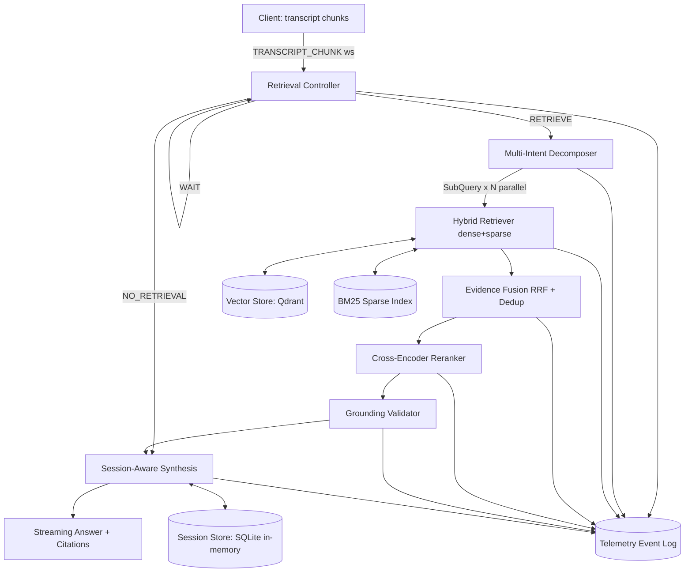
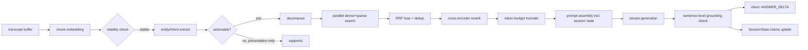
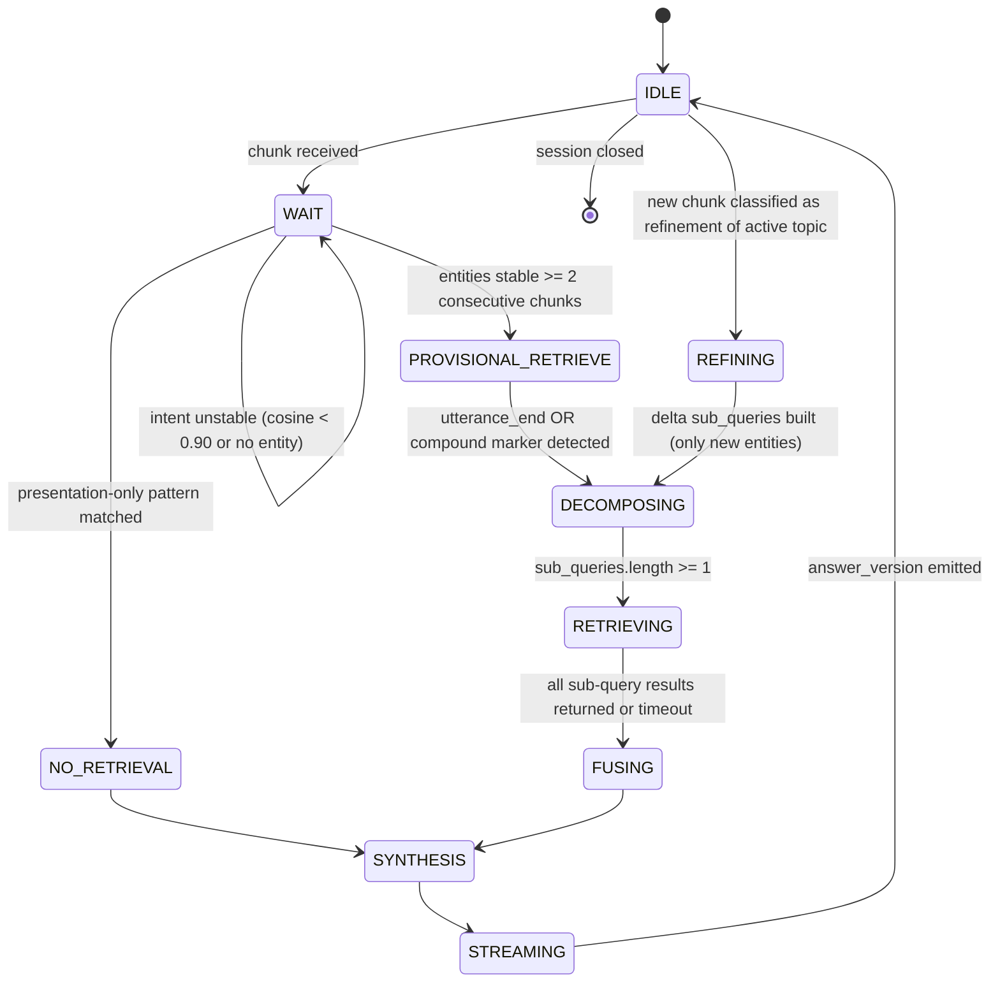
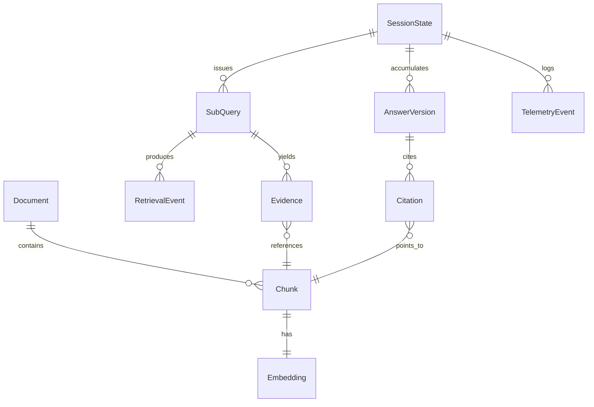

# Streaming Live RAG — PRD & TRD

Sep 23, 2026 · @Someone

Implementation-grade product and technical requirements for a full-duplex streaming RAG engine — incremental retrieval, multi-intent decomposition, session-aware refinement, strict corpus grounding — built against the Theme 04 specification's six evaluation gates (G1–G6).

## 1. PRD Part 1 — Overview, Problem, Goals, Personas

### 1.1 Product overview

Streaming Live RAG is a backend engine that answers a user's spoken or typed request while the request is still arriving. It consumes timestamped transcript chunks, decides per chunk whether to retrieve, decomposes compound requests into independent sub-queries, retrieves only from a supplied corpus, fuses and reranks evidence, and streams a grounded answer whose every factual claim carries a corpus citation. When the user adds a constraint after receiving an answer, the engine updates the existing answer instead of restarting.

### 1.2 Problem statement

Batch RAG waits for a complete utterance before searching, which adds seconds of dead air in voice and chat-support settings. It also treats each turn as a fresh query, so a single utterance that packages three questions gets one under-specified search, and a follow-up correction ("actually, make it international") triggers a full re-run that discards work already verified. None of this is solved by more retrieval — it requires an explicit model of retrieval *timing* (a controller with WAIT/RETRIEVE/NO-RETRIEVAL states), *decomposition* (compound → independent sub-queries), and *session-scoped memory* (delta refinement instead of restart).

### 1.3 Goals

| ID | Goal | Measured by |
| --- | --- | --- |
| GOAL-1 | Begin retrieval before the utterance ends when intent is stable | Gate G2, ≥80% early-retrieval rate |
| GOAL-2 | Decompose compound utterances into independently searchable sub-queries | Gate G3, ≥70% multi-intent accuracy |
| GOAL-3 | Every factual claim traceable to a corpus chunk ID, zero fabricated IDs | Gate G4, ≥85% grounding, 0% fabrication |
| GOAL-4 | Refine answers from late constraints without clearing session state or re-running full-corpus search | Gate G5, verified state continuity |
| GOAL-5 | 100% structured telemetry coverage of decisions, retrievals, citations, versions, cost, latency | Gate G6 |
| GOAL-6 | One-command reproducible deployment | Gate G1 |

### 1.4 Non-goals

- Not a general-purpose conversational agent or open-domain assistant — answers only from the supplied corpus.
- Not a cross-session personalization or profiling system — session memory is destroyed at session end (HARD-CONSTRAINT: session-only memory).
- Not a multi-agent orchestration framework — the pipeline is five deterministic stages, not autonomous agents calling each other.
- Not a production ASR/TTS system — the input is transcript chunks (real or simulated); speech-to-text and text-to-speech are out of scope.
- Not a general web-search-augmented assistant — no external web knowledge is permitted in answers.
- Not a fine-tuning or model-training project — retrieval and generation use off-the-shelf models via inference APIs/local weights only.

### 1.5 Personas / use cases

| Persona | Context | What they need from the system |
| --- | --- | --- |
| Voice support caller | Speaking a multi-part request to a phone/voice agent (e.g. venue booking with capacity, cancellation policy, catering) | Low latency-to-first-token; answer doesn't wait for the full sentence; all three sub-questions answered together |
| Chat/live-agent user | Typing incrementally, sometimes pausing mid-thought or correcting themselves | System doesn't retrieve on every keystroke or half-formed clause; corrects the existing answer instead of restarting |
| Compliance/ops reviewer | Needs every answer to be auditable after the fact | Full telemetry trace: which chunks triggered which retrievals, which chunk IDs back which sentence |
| Benchmark/evaluation harness | Automated grader replaying held-out transcripts | Deterministic, replayable API; explicit machine-readable retrieval decisions and citations, not just prose |

### 1.6 Core user journeys

**J1 — Streaming multi-intent query.** User starts speaking a compound request → controller WAITs while intent is unstable → PROVISIONAL\_RETRIEVE fires once a stable entity/intent signal appears → at utterance end the decomposer splits the request into sub-queries → parallel retrieval + fusion + rerank → one synthesized answer citing all sub-intents, with an uncertainty note for any sub-intent the corpus doesn't cover.

**J2 — Late-arriving constraint.** User receives Answer Version 1 → adds a constraint ("the trip was international") → controller classifies this as a refinement of the active topic, not a new topic → delta engine retrieves only for the new constraint → Answer Version 2 is emitted, preserving prior verified claims and their citations, adding new ones.

**J3 — Presentation-only follow-up.** User asks to reformat/shorten/repeat the last answer → suppression classifier detects no new fact is requested → no retrieval call is issued → existing session context is transformed and re-streamed.

**J4 — Insufficient evidence.** User asks something the corpus doesn't cover → retrieval executes, fusion returns low-relevance/empty evidence → grounding validator refuses to fabricate a citation → answer explicitly states uncertainty and asks a targeted clarifying question.

## 2. PRD Part 2 — Functional Requirements

Each requirement below maps 1:1 to a module in the TRD and a test in the benchmark suite (Part 8). Format: REQ-ID, description, input, expected behavior, output, failure behavior, acceptance test.

### 2.1 Streaming behavior (REQ-STREAM-\*)

**REQ-STREAM-01 — Incremental chunk ingestion**

- Description: The system accepts a sequence of timestamped transcript chunks per session, not a single final string.
- Input: `TRANSCRIPT_CHUNK` events `{session_id, seq, text_delta, t_offset_ms, is_final}`.
- Expected behavior: Each chunk is appended to a session-scoped rolling transcript buffer and passed to the Retrieval Controller within 50ms of receipt.
- Output: Updated transcript buffer; a controller decision event.
- Failure behavior: Out-of-order `seq` is buffered and reordered for up to 2s; beyond that it is applied as-is and logged as `ERROR: sequence_gap`.
- Acceptance test: BENCH-03 (incomplete streaming query) — chunks arrive at realistic intervals; buffer state matches concatenation at each step.

**REQ-STREAM-02 — No fake streaming**

- Description: Retrieval timing must be driven by actual partial-transcript state, not by waiting internally for the full utterance and only *emitting* results incrementally.
- Input: partial transcript at time T.
- Expected behavior: A `RETRIEVAL_STARTED` event's `t_offset_ms` must be strictly less than the recorded `is_final=true` chunk's `t_offset_ms` for any case classified as early retrieval.
- Output: Telemetry proving retrieval began pre-completion.
- Failure behavior: If `RETRIEVAL_STARTED.t_offset_ms >= utterance_end_offset_ms`, the case is logged as `late_retrieval`, not `early_retrieval`, and fails BENCH-04.
- Acceptance test: BENCH-04 / Early Retrieval Rate formula (Part 8).

### 2.2 Retrieval decision (REQ-CTRL-\*)

**REQ-CTRL-01 — WAIT on unstable intent**

- Description: The controller must not retrieve while the accumulated transcript's intent is still changing chunk-to-chunk.
- Input: transcript buffer + embedding of last K chunks.
- Expected behavior: If inter-chunk cosine similarity < `STABILITY_THRESHOLD` (default 0.90) or no actionable entity/intent is extracted, decision = WAIT.
- Output: `RETRIEVAL_DECISION{decision:"WAIT", reason}`.
- Failure behavior: If WAIT persists past `MAX_WAIT_CHUNKS` (default 6) with no resolution, force a decision at next chunk using best-available partial intent rather than waiting indefinitely.
- Acceptance test: BENCH-05 (premature-retrieval-avoidance case).

**REQ-CTRL-02 — Provisional early retrieval**

- Description: Retrieve before utterance end once semantic signal is sufficient.
- Input: transcript buffer where a stable, actionable entity set has persisted for ≥2 consecutive chunks.
- Expected behavior: decision = RETRIEVE (trigger=`provisional`), using the partial transcript as the query.
- Output: `RETRIEVAL_DECISION{decision:"RETRIEVE", trigger:"provisional"}` → dispatches to Multi-Intent Decomposer.
- Failure behavior: If the provisional retrieval later proves irrelevant (post-hoc similarity to final intent < 0.5), it is discarded from the answer context and logged as `wasted_retrieval`, not surfaced as an error to the user.
- Acceptance test: BENCH-04.

**REQ-CTRL-03 — No-retrieval classification**

- Description: Detect utterances that never require corpus search (see 2.5 Query Suppression) as early as possible so the controller never issues a RETRIEVE for them.
- Input: transcript buffer.
- Expected behavior: decision = NO\_RETRIEVAL with `reason` in {`presentation_only`, `no_actionable_intent`}.
- Output: `RETRIEVAL_DECISION{decision:"NO_RETRIEVAL"}`; pipeline routes straight to Session-Aware Synthesis using existing session context.
- Failure behavior: Misclassifying a factual request as NO\_RETRIEVAL is a grounding risk; the Synthesis stage runs a secondary check — if it needs a fact not present in session context, it emits `RETRIEVAL_DECISION{decision:"RETRIEVE", trigger:"synthesis_escalation"}` rather than fabricating.
- Acceptance test: BENCH-07 (no-retrieval formatting request).

### 2.3 Multi-intent (REQ-INTENT-\*)

**REQ-INTENT-01 — Compound request decomposition**

- Description: Detect ≥2 distinct, independently-answerable intents in one utterance and produce one sub-query per intent.
- Input: finalized (or stable provisional) transcript segment.
- Expected behavior: LLM structured-output call returns `sub_queries: [{text, intent_label}]`; sub-queries must be semantically distinct (pairwise cosine < 0.85) or they are merged.
- Output: `SUBQUERY_CREATED` event per sub-query.
- Failure behavior: If decomposition returns 0 sub-queries for a transcript with detected compound markers (multiple coordinating conjunctions + multiple domain entities), fall back to treating the whole transcript as one sub-query and log `decomposition_fallback`.
- Acceptance test: BENCH-02, Gate G3.

**REQ-INTENT-02 — Anti-over-fragmentation**

- Description: A simple single-intent query must not be split into near-duplicate sub-queries.
- Input: transcript with one entity/intent cluster.
- Expected behavior: Decomposer returns exactly 1 sub-query when no compound marker and no second distinct entity cluster is present.
- Output: single `SUBQUERY_CREATED`.
- Failure behavior: >1 sub-query with pairwise cosine similarity > 0.85 is auto-merged before dispatch and logged as `over_fragmentation_prevented`.
- Acceptance test: BENCH-01 (simple single-intent query).

### 2.4 Session refinement (REQ-SESS-\*)

**REQ-SESS-01 — Delta-only refinement**

- Description: A late constraint that modifies an already-answered topic must not re-run retrieval for previously satisfied sub-intents.
- Input: new transcript segment + active `SessionState` with ≥1 `AnswerVersion`.
- Expected behavior: Classifier labels the segment `refinement` (topic-similarity to active session topic ≥0.75 and/or contrastive marker present) vs `new_topic`. On `refinement`, only the delta entity/constraint is used to build new sub-queries.
- Output: `AnswerVersion N+1` referencing `AnswerVersion N`, with `preserved_citations` and `new_citations` fields populated separately.
- Failure behavior: If classification is ambiguous (topic-similarity between 0.4 and 0.75), the system asks a one-line disambiguating question rather than guessing.
- Acceptance test: BENCH-06 (late-arriving constraint), Gate G5.

**REQ-SESS-02 — Fact preservation**

- Description: Claims verified in a prior `AnswerVersion` and not contradicted by the new constraint must appear unchanged, with their original citations, in the refined version.
- Input: prior `AnswerVersion.claims[]`, new constraint.
- Expected behavior: Each prior claim is checked for contradiction against the new constraint (rule + LLM check); non-contradicted claims are copied forward verbatim with original `chunk_id` citations.
- Output: `AnswerVersion.claims[]` where `origin_version` is preserved per claim.
- Failure behavior: A claim contradicted by the new constraint is marked `superseded`, not silently dropped, and appears in telemetry.
- Acceptance test: BENCH-06.

**REQ-SESS-03 — Session isolation**

- Description: No fact, embedding, or preference may leak between `session_id`s.
- Input: any two concurrent sessions.
- Expected behavior: `SessionState` is keyed exclusively by `session_id`; store lookups always scope by that key; state is purged on session close/TTL expiry.
- Output: N/A (negative requirement).
- Failure behavior: Any cross-session read is a `SECURITY` class error, fails the build.
- Acceptance test: Unit test `test_session_isolation` asserts session B cannot read session A's `SessionState`.

### 2.5 Query suppression (REQ-SUPPRESS-\*)

**REQ-SUPPRESS-01 — Presentation-only detection**

- Description: Requests to reformat, shorten, translate register, repeat, or summarize the *existing* answer must not trigger retrieval.
- Input: transcript segment + active session context.
- Expected behavior: Rule-based pre-filter (regex over a maintained pattern set: reformat/shorten/repeat/bullet/summarize-what-you-said) + LLM confirmation when ambiguous; if `retrieval_required=false`, route directly to Synthesis operating only on `SessionState.last_answer`.
- Output: `RETRIEVAL_DECISION{decision:"NO_RETRIEVAL", reason:"presentation_restructure"}`.
- Failure behavior: If the suppressed request actually needs a new fact not in `last_answer` (e.g. "summarize AND add the price"), Synthesis's escalation check (REQ-CTRL-03 failure path) issues a targeted retrieval for only the new element.
- Acceptance test: BENCH-07.

### 2.6 Citation / grounding (REQ-GROUND-\*)

**REQ-GROUND-01 — Mandatory citation**

- Description: Every generated sentence containing a factual assertion must carry ≥1 citation to a real `chunk_id` returned by retrieval for that turn.
- Input: generated answer draft + evidence set used.
- Expected behavior: Grounding Validator segments the draft into claims, checks each claim's cited `chunk_id` ∈ evidence set AND passes a lexical/entailment overlap check against that chunk's text.
- Output: validated answer with `citations[]`; failed claims are rewritten or flagged.
- Failure behavior: A citation to a `chunk_id` not in the evidence set is a fabrication — the validator strips it and forces regeneration of that sentence with `citation_required=true`; if it still fails, the sentence is replaced with an uncertainty statement.
- Acceptance test: BENCH-10 (citation validation case), Gate G4, Fabricated Citation Rate formula = 0%.

**REQ-GROUND-02 — Explicit uncertainty**

- Description: When evidence is insufficient for a sub-intent, the system states this explicitly rather than answering generically.
- Input: fused evidence set with top rerank score below `MIN_RELEVANCE` (default 0.35) or empty.
- Expected behavior: Answer includes an `uncertainty` field naming which sub-intent is unresolved and, where useful, a targeted clarifying question.
- Output: `UNCERTAINTY` event + text in the answer.
- Failure behavior: Omitting the uncertainty note when evidence is insufficient fails BENCH-08.
- Acceptance test: BENCH-08 (insufficient-evidence query).

**REQ-GROUND-03 — Contradiction handling**

- Description: When retrieved evidence conflicts, the system must not silently pick one side.
- Input: fused evidence with pairwise semantic contradiction detected (negation/opposite-value check on the same entity+attribute across chunks).
- Expected behavior: Both positions are surfaced with their respective citations, or the more authoritative/recent source is preferred with an explicit note of the discrepancy.
- Output: answer text flags the conflict; `citations[]` includes both sources.
- Failure behavior: Merging conflicting evidence into one unqualified claim fails BENCH-09.
- Acceptance test: BENCH-09 (conflicting evidence).

## 3. PRD Part 3 — Observability, Security, Performance, Acceptance, Evaluation

### 3.1 Error and uncertainty behavior

| Condition | System behavior |
| --- | --- |
| No evidence above MIN\_RELEVANCE | Emit UNCERTAINTY; ask targeted clarifying question; never answer from parametric memory |
| Retrieval backend timeout/failure | Emit ERROR at stage retrieval; retry per TRD retry policy; if exhausted, degrade to session-context-only answer with explicit "couldn't search the corpus" note |
| LLM generation failure/timeout | Retry once with backoff; on second failure, return partial answer built from validated evidence snippets directly with an error flag |
| Citation validator rejects a sentence | Regenerate that sentence once with citation\_required=true; if still ungrounded, replace with uncertainty text — never emit an uncited factual sentence |
| Ambiguous refinement vs. new-topic classification | Ask a one-line disambiguating question instead of guessing |

### 3.2 Observability requirements

- REQ-OBS-01: Every stage transition emits a TelemetryEvent with event\_id, session\_id, timestamp, event\_type, payload, trace\_id.
- REQ-OBS-02: 100% of sessions have a complete, replayable trace covering transcript chunks, retrieval decisions and triggers, sub-queries, retrieved chunk IDs and scores, rerank order, citations, answer versions, token usage, latency per stage, uncertainty flags, errors (Gate G6).
- REQ-OBS-03: GET /session/{id}/events returns the full ordered event log for offline audit and benchmark scoring.
- REQ-OBS-04: Telemetry writes are non-blocking (async queue) and must never add more than 5ms to the critical path per event.

### 3.3 Security / privacy requirements

- REQ-SEC-01: Session state and transcripts are held in memory/ephemeral store only; no field is written to durable cross-session storage.
- REQ-SEC-02: Sessions expire and are purged after SESSION\_TTL (default 30 min idle) or on explicit close; purge is verified by a scheduled sweep, not client-triggered only.
- REQ-SEC-03: No corpus content or session transcript is sent to any third-party service other than the configured LLM/embedding/reranker inference endpoints, and only the minimum text needed for that call.
- REQ-SEC-04: API endpoints require a bearer token (API\_KEY) via the Authorization header; /evaluate additionally requires a separate EVAL\_KEY.
- REQ-SEC-05: All inbound text is treated as data, never as instructions to the retrieval/generation control plane (prompt-injection isolation between corpus content and system instructions).

### 3.4 Performance requirements

| Metric | Target | Rationale |
| --- | --- | --- |
| Time-to-first-retrieval-decision | under 150ms per chunk | Keeps controller off the critical path of transcript ingestion |
| Time-to-first-token (TTFT) on RETRIEVE path | under 1200ms p50 from utterance end or provisional trigger | Full retrieve-fuse-rerank-generate chain |
| End-to-end latency, answer complete | under 4000ms p50 for up to 3 sub-intents | Bench harness SLA |
| Parallel sub-query retrieval | wall time approx max of one retrieval, not the sum | Justifies parallel architecture |
| Token cost per turn | tracked and reported per session | Cost observability |

### 3.5 Acceptance criteria

A build is acceptance-ready when all REQ-\* acceptance tests in Part 2 pass, Gates G1 through G6 pass on the held-out benchmark set at their stated thresholds, docker compose up --build produces a working system with no manual steps, and pytest plus the benchmark runner both exit 0 in CI.

### 3.6 Evaluation methodology

1. Corpus and a held-out streaming test set (transcript-chunk sequences with gold sub-intents, gold relevant chunk IDs, gold refinement points) are loaded by scripts/run\_benchmark.py.
2. Each test case is replayed chunk-by-chunk through POST /session/{id}/stream, exactly as a real client would, at recorded timestamps.
3. The harness reads back GET /session/{id}/events and computes the ten metrics defined in Part 8 against gold labels.
4. Results are written to benchmarks/results/\<run\_id>.json and compared against the G1-G6 thresholds; POST /evaluate triggers this run over HTTP for CI and automated grading.
5. No prompt, sub-query, or answer is ever hardcoded against the held-out set — the harness only supplies transcripts and corpus; grading is done externally on the output.

### 3.7 Benchmark scenarios (summary — full detail in Part 8)

1. Simple single-intent query, 2. Compound multi-intent query, 3. Incomplete streaming query, 4. Early-retrieval-beneficial query, 5. Premature-retrieval-risk query, 6. Late-arriving constraint, 7. No-retrieval formatting request, 8. Insufficient-evidence query, 9. Conflicting evidence, 10. Citation validation case.

### 3.8 Definition of Done

- [ ] All REQ-\* implemented and covered by an automated test named after the REQ-ID.
- [ ] docker compose up --build launches the full stack (API, vector store, state store) with one command and no manual steps.
- [ ] scripts/ingest\_corpus.py ingests the supplied corpus deterministically (idempotent re-run produces the same chunk/embedding set).
- [ ] scripts/run\_benchmark.py runs all 10 benchmark scenarios and reports G1-G6 pass/fail with the exact formulas from Part 8.
- [ ] Telemetry trace exists and is complete for 100% of benchmark sessions.
- [ ] Zero fabricated citations across the sampled factual assertions.
- [ ] README documents local run, corpus ingestion, benchmark run, and the production deployment path.
- [ ] CI pipeline runs lint, unit tests, and the benchmark suite on every push to main.

## 4. TRD — System Architecture and Component Responsibilities

### 4.1 Architecture diagram



### 4.2 Component responsibilities

| Component | Module | Responsibility | Explicit non-responsibility |
| --- | --- | --- | --- |
| Retrieval Controller | app/controller/retrieval\_controller.py | Per-chunk WAIT/RETRIEVE/NO\_RETRIEVAL decision using embedding-stability + entity/intent extraction | Does not itself search the corpus or decompose queries |
| Multi-Intent Decomposer | app/decomposition/multi\_intent.py | Split a RETRIEVE-triggering transcript into 1..N distinct sub-queries | Does not decide whether to retrieve at all |
| Hybrid Retriever | app/retrieval/hybrid.py | Dense (Qdrant) + sparse (BM25) search per sub-query, run concurrently | Does not rerank or fuse across sub-queries |
| Evidence Fusion | app/retrieval/fusion.py | Reciprocal Rank Fusion across dense/sparse/sub-query result sets, dedup near-identical chunks | Does not call the LLM |
| Reranker | app/reranking/cross\_encoder.py | Cross-encoder relevance scoring of the fused candidate set, truncate to token budget | Does not fetch new candidates |
| Grounding Validator | app/grounding/citation\_validator.py | Claim segmentation, citation-to-chunk verification, uncertainty/contradiction flagging | Does not generate the answer text itself |
| Session-Aware Synthesis | app/session/delta\_engine.py + app/generation/streaming\_generator.py | Build the prompt from evidence + prior session state, stream the answer, run delta refinement logic, escalate to retrieval if a needed fact is missing | Does not perform full re-retrieval on every turn |
| Session Store | app/session/session\_store.py | In-memory dict backed by SQLite for crash recovery; strictly session\_id-scoped; TTL sweep | Not a cross-session profile store |
| Telemetry | app/telemetry/event\_logger.py | Async event emission, structured JSON, trace\_id propagation, persisted to SQLite events table | Not a metrics aggregation UI (Prometheus handles that) |
| API layer | app/api/\* | FastAPI routers for /session, /session/{id}/stream (WebSocket), /session/{id}, /session/{id}/events (SSE), /evaluate | Contains no business logic — delegates to core modules |

### 4.3 Why this shape and not more

Five pipeline stages map 1:1 to the five stages named in the specification's reference architecture. No additional agents are introduced: the Decomposer, Retriever, Fusion, Grounding and Synthesis stages are plain functions/classes orchestrated by a single async pipeline coroutine per turn — not autonomous LLM agents calling tools on each other. The only LLM calls are: (1) intent/entity extraction inside the Controller (small, cheap, can be swapped for a rule-based extractor), (2) decomposition, (3) answer synthesis, (4) grounding's entailment check (can fall back to lexical overlap to cut cost). This keeps the system auditable and matches the spec's "no unnecessary agent orchestration" constraint.

## 5. TRD — Request Lifecycle, Event Model, Data Flow, State Machine

### 5.1 End-to-end request lifecycle

1. Client opens `POST /session` → gets `session_id`, connects `WS /session/{id}/stream`.
2. Client sends `TRANSCRIPT_CHUNK` frames as the user speaks/types.
3. Each chunk: appended to buffer → Controller runs stability+intent check → decision emitted.
4. On RETRIEVE: Decomposer runs → sub-queries dispatched to Hybrid Retriever in parallel (`asyncio.gather`).
5. Results fused (RRF) → deduped → reranked (cross-encoder) → truncated to token budget.
6. Grounding-aware Synthesis builds the prompt (system instructions + evidence + prior session state) and streams tokens back over the same WebSocket as `ANSWER_DELTA` frames.
7. Grounding Validator runs on completed sentences (streamed sentence-by-sentence, not only at the end) — invalid citations are caught and corrected before that sentence is finalized to the client.
8. `ANSWER_VERSION_CREATED` is emitted when the answer is complete; `SessionState` is updated.
9. If a later chunk in the same session is classified as a refinement of the active topic, steps 3-8 repeat but scoped to the delta only, producing `AnswerVersion N+1` and an `ANSWER_DELTA` (not a full replay).
10. All of the above emit `TelemetryEvent`s to the async logger, independent of the response path.

### 5.2 Streaming event model

Bidirectional WebSocket on `/session/{id}/stream`. Inbound (client to server): `TRANSCRIPT_CHUNK`. Outbound (server to client): `RETRIEVAL_DECISION`, `SUBQUERY_CREATED`, `RETRIEVAL_STARTED`, `RETRIEVAL_COMPLETED`, `RERANK_COMPLETED`, `CITATION_CREATED`, `ANSWER_DELTA`, `ANSWER_VERSION_CREATED`, `UNCERTAINTY`, `ERROR`, `SESSION_UPDATED`. Every frame is one JSON object matching the TelemetryEvent envelope (Part 11). The client never needs to poll — `GET /session/{id}/events` is the audit/replay path, not the primary UX path.

### 5.3 Data flow



### 5.4 WAIT / RETRIEVE / NO-RETRIEVAL state machine



Transition guards: `WAIT -> PROVISIONAL_RETRIEVE` requires both (a) inter-chunk embedding cosine similarity above `STABILITY_THRESHOLD` for the last 2 chunks, and (b) at least one concrete, actionable entity extracted (a noun-phrase bound to a domain slot, e.g. location, quantity, date) — semantic stability alone is not sufficient, since a stable-but-empty clause ("I need to plan a...") must still WAIT.

## 6. TRD — Retrieval Controller and Multi-Intent Decomposition

### 6.1 Retrieval controller algorithm (design rationale; pseudocode in Part 12.A)

The controller keeps three pieces of rolling state per session: `embedding_history` (last K chunk embeddings), `entity_state` (accumulated slot-filled entities from a lightweight extractor), `wait_count`. On every chunk it computes cosine similarity between the newest chunk embedding and the mean of the previous K, checks the extractor for at least one new actionable entity, and checks a compiled regex/keyword set for presentation-only markers. This directly targets pitfall 1 (eager/permanent retrieval): retrieval never fires from lexical keyword alone, only from the conjunction of semantic stability and an actionable entity, and a session's `has_retrieved_for_topic` flag prevents re-firing on every subsequent chunk of the same stable topic (only new chunks that change `entity_state` re-trigger).

### 6.2 Multi-intent decomposition algorithm (design rationale; pseudocode in Part 12.B)

Decomposition only runs after the controller has already decided RETRIEVE — it is a downstream refinement, not a second retrieval trigger. It first checks cheap syntactic signals (coordinating conjunctions joining two distinct noun phrases bound to different domain slots, multiple wh-elements, an enumerated list). If signals are present, an LLM structured-output call proposes sub-queries; each proposed sub-query is embedded and pairwise-compared — any pair above `MERGE_THRESHOLD` (0.85 cosine) is merged into one, directly preventing pitfall 5 (over-fragmentation). If no compound signal is present, decomposition is skipped entirely and the transcript is used as the single sub-query, avoiding unnecessary LLM calls on simple requests.

### 6.3 Failure and edge-case handling

| Case | Handling |
| --- | --- |
| Entity extractor finds an entity but it's not bound to a known domain slot | Do not retrieve; treat as still-WAIT (avoids retrieving on noise like a stray proper noun) |
| Provisional retrieval's partial query later proven irrelevant once the full utterance lands | Discard from evidence set, do not surface as an error, log `wasted_retrieval` for the Early Retrieval Rate metric denominator |
| Decomposer LLM call fails/times out | Fall back to whole-transcript single sub-query, log `decomposition_fallback`, do not block the turn |
| Two sub-queries target the same corpus section but different attributes (e.g. venue capacity vs. venue cancellation policy) | Kept distinct — pairwise similarity check operates on the sub-query *text* embedding, which differs enough by attribute wording to stay under the merge threshold |

## 7. TRD — Hybrid Retrieval, Parallel Architecture, Fusion, Reranking, Dedup

### 7.1 Parallel retrieval architecture

Each sub-query from the Decomposer is dispatched as an independent `asyncio.Task` running dense search (Qdrant) and sparse search (BM25) concurrently for that sub-query; all sub-query tasks across the whole utterance also run concurrently via `asyncio.gather`, bounded by `MAX_CONCURRENT_RETRIEVALS` (default 8) to protect the vector store. A per-task timeout (`RETRIEVAL_TIMEOUT_MS`, default 800ms) means one slow sub-query cannot stall the others; a timed-out sub-query contributes no evidence and is logged, not retried inline (retry policy in §9).

### 7.2 Hybrid retrieval strategy

Dense: sub-query text embedded with the same model as the corpus (BAAI/bge-small-en-v1.5), top-`K_DENSE` (default 20) nearest chunks from Qdrant by cosine similarity. Sparse: BM25 (`rank_bm25.BM25Okapi`) over a tokenized corpus index built at ingestion time, top-`K_SPARSE` (default 20). Both run against the corpus only — no external index, no web search, satisfying corpus isolation.

### 7.3 Evidence fusion (Reciprocal Rank Fusion)

For each sub-query, dense and sparse rank lists are combined with RRF: `score(chunk) = sum over lists of 1 / (rrf_k + rank_in_list)`, `rrf_k = 60` (standard constant). Across sub-queries, per-sub-query fused lists are kept separately tagged with their `sub_query_id` so the Synthesis stage can address every sub-intent, but a global fused pool is also computed (RRF again, across sub-query result sets) for cross-sub-query deduplication.

### 7.4 Deduplication

Two chunks are treated as duplicates if `chunk_id` matches exactly, or if their embedding cosine similarity exceeds `DEDUP_THRESHOLD` (0.95) — the higher-fused-score instance is kept, the other dropped from the candidate pool but its `chunk_id` is retained in a `duplicate_of` map for telemetry so the reranker isn't silently double-counting near-identical text.

### 7.5 Reranking

The deduplicated top-`RERANK_CANDIDATES` (default 30) pool is scored by a cross-encoder (`cross-encoder/ms-marco-MiniLM-L-6-v2`) against each sub-query text, producing a calibrated relevance score per (sub\_query, chunk) pair. The top-`FINAL_K` (default 6 per sub-query, cap 15 total) chunks by rerank score, subject to a token budget (`EVIDENCE_TOKEN_BUDGET`, default 3000 tokens), are passed to Synthesis. Any chunk below `MIN_RELEVANCE` (0.35) is excluded and its sub-query is flagged `low_evidence` for the Grounding stage's uncertainty logic.

### 7.6 Avoiding contradictory/irrelevant evidence

Before truncation, chunks addressing the same (entity, attribute) pair with materially different values are flagged as a `contradiction_pair` (simple heuristic: same top noun-phrase + numeric/categorical value extraction differs) and both are retained (not silently deduped) so Synthesis can surface the conflict per REQ-GROUND-03, rather than the reranker's top-1 arbitrarily winning.

## 8. TRD — Session Refinement, Citations, Grounding, Suppression

### 8.1 Session state schema (summary; full field list in Part 13)

`SessionState` holds: `session_id`, `topic_embedding` (running centroid of retrieved-for entities), `entities` (slot-filled dict), `claims[]` (each with `text`, `chunk_id`, `origin_version`, `status` in {active, superseded}), `answer_versions[]`, `retrieval_log[]` (sub-queries already executed, to avoid re-issuing identical searches), `created_at`, `last_active_at`. Held in an in-process dict for read/write speed, mirrored to a SQLite table on every mutation for crash recovery within the container's lifetime only — never queried across `session_id`.

### 8.2 Answer versioning

Each synthesis pass produces one `AnswerVersion{version_no, text, claims[], citations[], supersedes, created_at}`. `version_no` increments monotonically per session. A refinement's `AnswerVersion` references `supersedes = version_no - 1` and its `claims[]` are partitioned into `carried_forward` (copied from the prior version, unchanged citation) and `new` (from the delta retrieval). The client receives only the new/changed text as an `ANSWER_DELTA`, plus the full `AnswerVersion` in `ANSWER_VERSION_CREATED` for audit.

### 8.3 Late-detail delta refinement algorithm (design rationale; pseudocode Part 12.G)

On a new chunk while `SessionState.answer_versions` is non-empty: compute cosine similarity between the new chunk's embedding and `topic_embedding`, and scan for contrastive markers ("actually", "wait", "also", "but", "instead", a negation of a previously stated entity value). If similarity ≥ `REFINEMENT_THRESHOLD` (0.75) this is a refinement: extract only the newly introduced entity/constraint (diff against `entities`), build a delta sub-query scoped to that constraint, retrieve/fuse/rerank only for it, re-check `claims[]` for contradiction against the new constraint, mark contradicted ones `superseded`, append new claims, emit `AnswerVersion N+1`. If similarity < 0.4, treat as a new topic — full pipeline restart with a fresh (but same-session) retrieval context. Between 0.4 and 0.75, ask a one-line disambiguating question (REQ-SESS-01 failure path) rather than guess, directly addressing pitfall 2 (context loss on late constraints) without over-triggering full restarts.

### 8.4 Citation mapping

Every chunk returned to Synthesis carries `{chunk_id, doc_id, section, text, score}`. The generation prompt instructs the model to tag each factual sentence with `[doc_id §section]` inline, using only IDs present in the supplied evidence block (never free-form). The Grounding Validator parses these tags post-generation and maps each to the corresponding `Citation{chunk_id, doc_id, section, claim_text, evidence_span}` record.

### 8.5 Grounding verification (design rationale; pseudocode Part 12.F)

For each generated sentence: (1) extract the cited `chunk_id`(s); (2) reject immediately if any cited id is not in the evidence set actually passed to the model for that turn (this alone eliminates fabricated-ID errors, since the model physically cannot cite an id it wasn't shown, and any id it invents fails the set-membership check); (3) compute a lexical overlap / cross-encoder entailment score between the claim sentence and the cited chunk's text — below `ENTAILMENT_MIN` (0.3) triggers one regeneration attempt with `citation_required=true`; (4) if still failing, replace the sentence with an explicit uncertainty statement rather than emit it.

### 8.6 Query suppression (design rationale; pseudocode Part 12.H)

A compiled pattern set (reformat/shorten/expand/bulletize/translate-register/repeat/summarize-what-you-said, in the target language(s)) is checked first against the new chunk; if matched AND no new domain entity is detected relative to `entities`, suppression fires and Synthesis operates only on `SessionState.answer_versions[-1].text`. This is checked *before* the Controller's stability/entity logic runs its RETRIEVE path, so a presentation-only follow-up never reaches the Decomposer, directly addressing pitfall 4 (ignoring presentation-only requests would otherwise waste a retrieval call).

## 9. TRD — Streaming Generation, Telemetry, Errors, Caching, Concurrency, Security, Config

### 9.1 Streaming response generation

The LLM call uses the provider's native token-streaming (Anthropic Messages API `stream=true`). Tokens are buffered into sentence units (split on sentence-final punctuation) — the Grounding Validator runs per sentence, not per token, so a sentence is only forwarded to the client as `ANSWER_DELTA` once it passes grounding; this bounds worst-case correction cost to one sentence rather than the whole answer, while still delivering meaningfully incremental output.

### 9.2 Telemetry / event schema

All events share the envelope in Part 11.3 (`event_id, session_id, timestamp, event_type, payload, trace_id`). `trace_id` is generated once per turn (one user chunk-triggered pipeline run, or one refinement pass) and threaded through every event that turn produces, so `GET /session/{id}/events?trace_id=...` reconstructs one full pipeline execution. Events are written via an `asyncio.Queue` consumed by a background writer task batching inserts to SQLite every 100ms, so emission never blocks the response path (REQ-OBS-04).

### 9.3 Error handling

Every pipeline stage is wrapped in a try/except that converts exceptions into an `ERROR` telemetry event with `{stage, error_type, message, recoverable}` and a defined fallback (Part 3.1 table) rather than propagating a raw 500 to the WebSocket. The WebSocket connection itself is only closed on unrecoverable errors (e.g. session store corruption); a stage-level failure degrades gracefully and the session continues.

### 9.4 Retry / timeouts

| Call | Timeout | Retry policy |
| --- | --- | --- |
| Embedding call | 500ms | 1 retry, exponential backoff 200ms |
| Dense/sparse retrieval | 800ms per sub-query | No retry — timed-out sub-query contributes no evidence, logged |
| Cross-encoder rerank | 600ms | 1 retry; on second failure, skip rerank and use RRF order directly |
| LLM generation | 10s per sentence | 1 retry with backoff; on second failure, fall back to extractive answer (evidence snippets verbatim, flagged) |
| Grounding entailment check | 400ms | 1 retry; on failure, fall back to lexical-overlap-only check (cheaper, stricter threshold) |

### 9.5 Caching strategy

Embedding cache: an LRU cache (in-process, `functools.lru_cache`-style keyed by text hash) avoids re-embedding an identical sub-query within a session. Corpus embeddings are computed once at ingestion and persisted in Qdrant — never recomputed at query time. No answer-level caching across turns or sessions, since answers are session- and evidence-specific; caching them risks staleness against the corpus and violates session isolation if scoped incorrectly.

### 9.6 Concurrency model

Single FastAPI process, `asyncio` event loop; per-session pipeline state is isolated in a `SessionState` object guarded by an `asyncio.Lock` per session (not a global lock) so concurrent sessions never block each other, while operations within one session (e.g. a refinement arriving while the prior turn is still streaming) are serialized to keep `claims[]`/`answer_versions[]` consistent. CPU-bound work (cross-encoder inference) runs in a bounded `ThreadPoolExecutor` to avoid blocking the event loop.

### 9.7 Security boundaries

API layer validates all inbound payloads with Pydantic models (reject malformed frames before they touch business logic). Corpus content and session transcripts are the only data sent to the LLM/embedding/reranker; system instructions and corpus content are kept in separate, clearly delimited prompt sections so retrieved text cannot be interpreted as an instruction override (prompt-injection isolation, REQ-SEC-05). `/evaluate` is gated behind a separate key and, in production config, an IP allowlist, since it can trigger cost-incurring bulk pipeline runs.

### 9.8 Configuration management

All tunables (thresholds in §6-8, timeouts in §9.4, model names, `K_DENSE`/`K_SPARSE`/`FINAL_K`, etc.) live in `app/core/config.py` as a Pydantic `BaseSettings` class reading from environment variables with `.env` defaults (see `.env.example`, Part 10). No tunable is hardcoded inline in pipeline modules, so behavior can be re-tuned per deployment without code changes.

## 10. Part 3 — Actual Technical Stack

| Layer | Choice | Why this one, briefly |
| --- | --- | --- |
| Backend framework | FastAPI | Native async, first-class WebSocket support for full-duplex streaming, Pydantic validation built in, minimal boilerplate for a single-process service |
| Language | Python 3.11+ | Ecosystem fit for retrieval/reranking libraries; asyncio sufficient for this I/O-bound pipeline |
| LLM | Anthropic Claude (Messages API, streaming) | Native streaming, strong structured-output/tool-use for decomposition and citation tagging, single-vendor simplicity |
| Embedding model | BAAI/bge-small-en-v1.5 (via sentence-transformers, local CPU inference) | No external API call on the retrieval-timing-critical path, deterministic, fast enough for real-time chunk embedding, no added latency/cost per chunk |
| Vector database | Qdrant (self-hosted via docker-compose) | Runs in-compose with no external account, supports payload filtering for metadata, mature Python client, fast enough at demo corpus scale |
| Sparse retrieval | BM25 (rank\_bm25) over a persisted tokenized index | Simple, no extra model download, easy to reason about for hybrid RRF fusion |
| Reranker | cross-encoder/ms-marco-MiniLM-L-6-v2 (sentence-transformers) | Small enough for CPU inference within the latency budget, strong relevance lift over RRF alone |
| API protocol | REST (session lifecycle) + WebSocket (streaming) | REST fits create/read; WebSocket is the only protocol that models true full-duplex chunk-in/answer-out |
| Streaming protocol | WebSocket for /stream; Server-Sent Events for /events replay | WebSocket for bidirectional live traffic; SSE is simpler and sufficient for one-way telemetry replay |
| State store | SQLite (via SQLAlchemy), in-process dict as the hot path | Zero external dependency, file-based, trivially reproducible in a single container; swappable for Postgres in production |
| Logging | structlog, JSON output | Structured logs are directly queryable and match the TelemetryEvent envelope |
| Metrics | prometheus-client, /metrics endpoint | Standard scrape format; optional Grafana in production, not required for the demo gate |
| Testing framework | pytest + pytest-asyncio | Standard for async FastAPI services |
| Containerization | Docker + docker-compose | Two services only (app, qdrant) — satisfies G1 with a single command, no Kubernetes needed |
| Deployment target (prod) | Single container (Fly.io / Render / AWS Fargate) + managed or self-hosted Qdrant + Postgres swap for SQLite | Avoids Kubernetes/microservices the spec explicitly says not to over-engineer; one deployable service is sufficient at this scale |

This is a deliberately two-service system (`app`, `qdrant`) — BM25 index and SQLite both live inside the `app` container's volume, so there is nothing else to orchestrate.

## 11. Part 4 — API Contracts

### 11.1 POST /session

Creates a new, empty session.

Request: `{"corpus_id": "default", "client_meta": {}}` (both optional).

Response `201`: `{"session_id": "sess_9f2a", "created_at": "2026-09-23T10:00:00Z", "ws_url": "/session/sess_9f2a/stream"}`.

Errors: `401` missing/invalid API key; `400` unknown `corpus_id`.

### 11.2 WS /session/{id}/stream

Bidirectional. Client sends `TRANSCRIPT_CHUNK` frames; server streams every event type listed in §11.3.

Client → server frame:

```json
{"event_type": "TRANSCRIPT_CHUNK", "payload": {"seq": 3, "text_delta": "...for 30 people, and I need...", "t_offset_ms": 800, "is_final": false}}
```

Server → client frame (example, RETRIEVAL\_DECISION):

```json
{"event_id": "evt_01", "session_id": "sess_9f2a", "timestamp": "2026-09-23T10:00:00.812Z", "event_type": "RETRIEVAL_DECISION", "payload": {"decision": "RETRIEVE", "trigger": "provisional", "reason": "stable entities: venue, capacity=30"}, "trace_id": "trc_77"}
```

Errors: connection closes with code `4401` on auth failure, `4404` on unknown `session_id`; a stage-level failure is delivered as an `ERROR` event, not a socket close.

### 11.3 Standard event envelope

```json
{
  "event_id": "string, uuid",
  "session_id": "string",
  "timestamp": "ISO-8601 UTC",
  "event_type": "string, enum (below)",
  "payload": {},
  "trace_id": "string, uuid, shared by one pipeline turn"
}
```

### 11.4 Event types and payloads

| event\_type | payload fields |
| --- | --- |
| TRANSCRIPT\_CHUNK | seq, text\_delta, t\_offset\_ms, is\_final |
| RETRIEVAL\_DECISION | decision (WAIT\|RETRIEVE\|NO\_RETRIEVAL), trigger, reason |
| SUBQUERY\_CREATED | sub\_query\_id, text, intent\_label |
| RETRIEVAL\_STARTED | sub\_query\_id, mode (dense\|sparse), t\_offset\_ms |
| RETRIEVAL\_COMPLETED | sub\_query\_id, mode, result\_count, latency\_ms |
| RERANK\_COMPLETED | sub\_query\_id, ranked\_chunk\_ids, scores |
| CITATION\_CREATED | chunk\_id, doc\_id, section, claim\_text |
| ANSWER\_VERSION\_CREATED | version\_no, text, citations\[\], supersedes |
| ANSWER\_DELTA | version\_no, text\_delta, is\_final\_sentence |
| UNCERTAINTY | sub\_query\_id, reason, clarifying\_question |
| ERROR | stage, error\_type, message, recoverable |
| SESSION\_UPDATED | field, old\_value, new\_value |

### 11.5 GET /session/{id}

Current session snapshot.

Response `200`: `{"session_id": "sess_9f2a", "status": "active", "entities": {...}, "latest_answer_version": 2, "created_at": "...", "last_active_at": "..."}`.

Errors: `404` unknown session.

### 11.6 GET /session/{id}/events

Full ordered event log for replay/audit. Query params: `trace_id` (filter to one pipeline turn), `event_type`, `since` (ISO timestamp). Transport: SSE stream of the envelope in §11.3, or `?format=json` for a single array response used by the benchmark harness.

Errors: `404` unknown session; `410` if the session's log has been purged post-TTL.

### 11.7 POST /evaluate

Triggers a benchmark run against a named test set; requires `EVAL_KEY`.

Request: `{"test_set": "benchmarks/streaming_suite_v1", "corpus_id": "default"}`.

Response `202`: `{"run_id": "run_44", "status": "queued"}`. Result retrieved via `GET /evaluate/{run_id}` (not polled synchronously): `{"run_id": "run_44", "status": "complete", "gates": {"G1": "pass", "G2": {"value": 0.83, "target": 0.80, "pass": true}, ...}, "metrics": {...}}`.

Errors: `401`/`403` bad or missing `EVAL_KEY`; `409` a run is already in progress for that `test_set`.

## 12. Part 5 — Core Algorithm Pseudocode

### 12.A Retrieval Controller

```python
def on_chunk(session, chunk):
    session.buffer.append(chunk)
    emb = embed(chunk.text_delta)
    session.embedding_history.append(emb)

    if is_presentation_only(session.buffer, session.last_answer):
        return decide(session, "NO_RETRIEVAL", trigger="presentation_only")

    new_entities = extract_entities(session.buffer, known_slots=CORPUS_SLOTS)
    entity_delta = diff(new_entities, session.entities)
    session.entities.update(new_entities)

    if not entity_delta and session.has_retrieved_for_topic:
        return decide(session, "WAIT", trigger="no_new_entity")

    stability = mean_cosine(session.embedding_history[-K:])
    if stability < STABILITY_THRESHOLD or not entity_delta:
        session.wait_count += 1
        if session.wait_count > MAX_WAIT_CHUNKS:
            return decide(session, "RETRIEVE", trigger="forced_after_max_wait")
        return decide(session, "WAIT", trigger="intent_unstable")

    session.wait_count = 0
    trigger = "final" if chunk.is_final else "provisional"
    session.has_retrieved_for_topic = True
    return decide(session, "RETRIEVE", trigger=trigger)
```

### 12.B Multi-Intent Decomposer

```python
def decompose(transcript, session):
    if not has_compound_signal(transcript):        # conjunctions across 2+ domain slots, enumerations
        return [SubQuery(text=transcript, intent_label="single")]

    proposed = llm_structured_call(
        DECOMPOSE_PROMPT, transcript, schema=SubQueryList, timeout_ms=1500
    )
    if not proposed:
        log("decomposition_fallback")
        return [SubQuery(text=transcript, intent_label="single")]

    merged = []
    for sq in proposed:
        dup = next((m for m in merged if cosine(embed(m.text), embed(sq.text)) > MERGE_THRESHOLD), None)
        if dup is None:
            merged.append(sq)
        else:
            log("over_fragmentation_prevented", a=dup.text, b=sq.text)
    return merged
```

### 12.C Hybrid Retriever

```python
async def hybrid_retrieve(sub_query):
    dense_task = qdrant_search(embed(sub_query.text), top_k=K_DENSE, timeout_ms=800)
    sparse_task = bm25_search(tokenize(sub_query.text), top_k=K_SPARSE, timeout_ms=800)
    dense, sparse = await asyncio.gather(dense_task, sparse_task, return_exceptions=True)
    dense = dense if not isinstance(dense, Exception) else []
    sparse = sparse if not isinstance(sparse, Exception) else []
    return RetrievalResult(sub_query_id=sub_query.id, dense=dense, sparse=sparse)
```

### 12.D Evidence Fusion

```python
def fuse(retrieval_results, rrf_k=60):
    per_subquery = {}
    for r in retrieval_results:
        scores = defaultdict(float)
        for rank, chunk in enumerate(r.dense):
            scores[chunk.id] += 1.0 / (rrf_k + rank + 1)
        for rank, chunk in enumerate(r.sparse):
            scores[chunk.id] += 1.0 / (rrf_k + rank + 1)
        per_subquery[r.sub_query_id] = sorted(scores.items(), key=lambda kv: -kv[1])

    deduped = dedup(per_subquery, threshold=DEDUP_THRESHOLD)
    contradictions = flag_contradictions(deduped)
    return deduped, contradictions
```

### 12.E Reranking

```python
def rerank(sub_query, candidates, cross_encoder):
    pairs = [(sub_query.text, c.text) for c in candidates[:RERANK_CANDIDATES]]
    scores = cross_encoder.predict(pairs)          # batched, thread-pool executor
    ranked = sorted(zip(candidates, scores), key=lambda cs: -cs[1])
    kept = [(c, s) for c, s in ranked if s >= MIN_RELEVANCE][:FINAL_K]
    if not kept:
        flag_low_evidence(sub_query)
    return truncate_to_token_budget(kept, EVIDENCE_TOKEN_BUDGET)
```

### 12.F Citation / Grounding Validator

```python
def validate_sentence(sentence, evidence_by_id):
    cited_ids = extract_citation_tags(sentence)          # e.g. [Doc_12 §2]
    if any(cid not in evidence_by_id for cid in cited_ids):
        return Regenerate(reason="fabricated_id")
    if not cited_ids:
        return Regenerate(reason="missing_citation")

    entailment = max(
        entailment_score(sentence, evidence_by_id[cid].text) for cid in cited_ids
    )
    if entailment < ENTAILMENT_MIN:
        return Regenerate(reason="low_entailment")
    return Accept(citations=[to_citation(cid, evidence_by_id) for cid in cited_ids])

def finalize_sentence(sentence, evidence_by_id, attempt=0):
    result = validate_sentence(sentence, evidence_by_id)
    if isinstance(result, Accept) or attempt >= 1:
        return result if isinstance(result, Accept) else Uncertain(reason=result.reason)
    regenerated = llm_regenerate(sentence, citation_required=True)
    return finalize_sentence(regenerated, evidence_by_id, attempt=attempt + 1)
```

### 12.G Session Delta Refinement

```python
def classify_and_refine(session, new_chunk):
    if not session.answer_versions:
        return route_to_full_pipeline(session, new_chunk)

    sim = cosine(embed(new_chunk.text_delta), session.topic_embedding)
    contrastive = has_contrastive_marker(new_chunk.text_delta)

    if sim >= REFINEMENT_THRESHOLD or contrastive:
        delta_entities = diff(extract_entities(new_chunk.text_delta), session.entities)
        delta_sq = SubQuery(text=build_delta_query(delta_entities), intent_label="delta")
        evidence, _ = fuse([hybrid_retrieve_sync(delta_sq)])
        reranked = rerank(delta_sq, evidence[delta_sq.id], cross_encoder)

        for claim in session.claims:
            if contradicts(claim, delta_entities):
                claim.status = "superseded"

        new_answer = synthesize(
            carried_forward=[c for c in session.claims if c.status == "active"],
            new_evidence=reranked,
            prior_version=session.answer_versions[-1],
        )
        return commit_new_version(session, new_answer, supersedes=session.answer_versions[-1].version_no)

    elif sim < 0.4:
        return route_to_full_pipeline(session, new_chunk)          # new topic, same session
    else:
        return ask_disambiguation(session)                         # 0.4 <= sim < REFINEMENT_THRESHOLD
```

### 12.H Query Suppression

```python
SUPPRESSION_PATTERNS = compile_patterns([
    r"\b(reformat|shorten|bullet|summariz|repeat|rephrase|translate)\b", ...
])

def check_suppression(transcript, session):
    if not SUPPRESSION_PATTERNS.search(transcript.lower()):
        return None
    new_entities = extract_entities(transcript, known_slots=CORPUS_SLOTS)
    if diff(new_entities, session.entities):
        return None                                  # asks for a new fact too — do not suppress
    if is_ambiguous(transcript):
        return llm_confirm_suppression(transcript, session.last_answer)
    return SuppressionResult(retrieval_required=False, reason="presentation_restructure")
```

### 12.I Streaming Answer Generator

```python
async def stream_answer(session, evidence, prior_version=None):
    prompt = build_prompt(evidence, session, prior_version)
    buffer = ""
    async for token in llm_stream(prompt):
        buffer += token
        if is_sentence_boundary(buffer):
            sentence, buffer = split_last_sentence(buffer)
            result = finalize_sentence(sentence, evidence.by_id)
            if isinstance(result, Uncertain):
                sentence = uncertainty_text(result.reason)
            await emit("ANSWER_DELTA", session, text_delta=sentence)
            record_claim(session, sentence, result)
    if buffer:
        result = finalize_sentence(buffer, evidence.by_id)
        await emit("ANSWER_DELTA", session, text_delta=buffer, is_final_sentence=True)
        record_claim(session, buffer, result)
    await emit("ANSWER_VERSION_CREATED", session, version=build_answer_version(session))
```

Each algorithm above directly targets one pitfall named in the spec: 12.A gates retrieval on stability+entity conjunction (no eager retrieval); 12.G diffs entities rather than restarting (no context loss); 12.F rejects out-of-set citation IDs by construction (no fabrication); 12.H checks patterns before the controller's RETRIEVE path (no wasted retrieval on presentation-only turns); 12.B merges near-duplicate sub-queries (no over-fragmentation).

## 13. Part 6 — Data Models and Vector-Store Schema

All schemas below are Pydantic models in app/models/. IDs are ULIDs unless noted.

### 13.1 Document

`doc_id` (str, PK) · `title` (str) · `source_path` (str) · `ingested_at` (datetime) · `content_hash` (str, for idempotent re-ingestion) · `section_count` (int).

### 13.2 Chunk

`chunk_id` (str, PK) · `doc_id` (FK → Document) · `section` (str, e.g. "§2") · `text` (str) · `token_count` (int) · `chunk_index` (int, order within doc) · `bm25_tokens` (list\[str\], cached).

### 13.3 Embedding

`chunk_id` (str, PK/FK → Chunk) · `vector` (float\[384\], bge-small dim) · `model_name` (str) · `created_at` (datetime). Stored as a Qdrant point payload+vector, mirrored `chunk_id` in SQLite for joinability.

### 13.4 RetrievalEvent

`event_id` (PK) · `session_id` (FK) · `sub_query_id` (FK) · `mode` (enum: dense|sparse) · `result_chunk_ids` (list\[str\]) · `scores` (list\[float\]) · `latency_ms` (int) · `t_offset_ms` (int) · `trigger` (enum: provisional|final|delta|forced\_after\_max\_wait).

### 13.5 SubQuery

`sub_query_id` (PK) · `session_id` (FK) · `text` (str) · `intent_label` (str) · `parent_transcript_offset` (int) · `created_at` (datetime) · `merged_from` (list\[str\], ids absorbed during anti-fragmentation).

### 13.6 Evidence

`evidence_id` (PK) · `sub_query_id` (FK) · `chunk_id` (FK → Chunk) · `fusion_score` (float) · `rerank_score` (float, nullable) · `duplicate_of` (str, nullable, FK → Chunk) · `contradiction_pair_id` (str, nullable).

### 13.7 Citation

`citation_id` (PK) · `answer_version_id` (FK) · `chunk_id` (FK → Chunk) · `doc_id` (FK → Document) · `section` (str) · `claim_text` (str) · `entailment_score` (float).

### 13.8 SessionState

`session_id` (PK) · `topic_embedding` (float\[384\]) · `entities` (JSON dict) · `claims` (JSON list of {claim\_id, text, chunk\_id, origin\_version, status}) · `answer_versions` (list\[str\], FK → AnswerVersion) · `retrieval_log` (JSON list of executed sub-query texts, dedup guard) · `created_at` · `last_active_at` · `status` (enum: active|closed|expired).

### 13.9 AnswerVersion

`answer_version_id` (PK) · `session_id` (FK) · `version_no` (int) · `text` (str) · `citations` (list\[str\], FK → Citation) · `supersedes` (int, nullable) · `carried_forward_claim_ids` (list\[str\]) · `new_claim_ids` (list\[str\]) · `created_at`.

### 13.10 TelemetryEvent

`event_id` (PK) · `session_id` (FK) · `trace_id` (str, indexed) · `timestamp` (datetime, indexed) · `event_type` (enum, §11.4) · `payload` (JSON).

### 13.11 EvaluationResult

`run_id` (PK) · `test_set` (str) · `corpus_id` (str) · `gates` (JSON: {G1..G6: {value, target, pass}}) · `metrics` (JSON: the ten Part 8 formulas) · `started_at` · `completed_at` · `status` (enum: queued|running|complete|failed).

### 13.12 Relationships



### 13.13 Vector-store schema (Qdrant)

Collection `corpus_chunks`: vector size 384, distance = Cosine. Payload fields (indexed): `chunk_id` (keyword), `doc_id` (keyword), `section` (keyword), `text` (text, for payload-level filtering only — not the search field). One point per Chunk, point id = `chunk_id`. A second collection `bm25_index` is not used — BM25 is maintained as a pickled inverted index in `data/processed/bm25.pkl`, rebuilt by `scripts/ingest_corpus.py` and loaded at app startup; this keeps sparse retrieval out of the vector store and avoids needing Qdrant's sparse-vector feature for a demo-scale corpus.

## 14. Part 7 — Repository Structure

```text
/app
  /api
    session.py          # POST /session, GET /session/{id}
    stream.py            # WS /session/{id}/stream
    events.py            # GET /session/{id}/events (SSE)
    evaluate.py           # POST /evaluate, GET /evaluate/{run_id}
    deps.py               # auth (API_KEY/EVAL_KEY), shared FastAPI dependencies
  /core
    config.py             # Pydantic BaseSettings, all tunables from env
    events.py             # TelemetryEvent envelope + event_type enum
    embeddings.py          # bge-small load + embed() wrapper, LRU cache
  /controller
    retrieval_controller.py   # 12.A: WAIT/RETRIEVE/NO_RETRIEVAL state machine
    entity_extraction.py       # domain-slot entity extractor
    suppression.py              # 12.H: presentation-only pattern match + LLM confirm
  /decomposition
    multi_intent.py        # 12.B: compound-signal check + LLM decomposition + merge
  /retrieval
    dense.py               # Qdrant client wrapper
    sparse_bm25.py          # BM25 index build/load/search
    hybrid.py                # 12.C: concurrent dense+sparse per sub-query
    fusion.py                 # 12.D: RRF + dedup + contradiction flagging
  /reranking
    cross_encoder.py        # 12.E: ms-marco-MiniLM-L-6-v2 wrapper
  /session
    session_store.py         # SessionState CRUD, in-memory + SQLite mirror, TTL sweep
    delta_engine.py            # 12.G: refinement classification + delta retrieval
  /generation
    prompt_builder.py         # assembles evidence + session state into the LLM prompt
    streaming_generator.py     # 12.I: sentence-boundary streaming + inline grounding
  /grounding
    citation_validator.py     # 12.F: claim segmentation, id-membership, entailment
  /telemetry
    event_logger.py          # async queue -> batched SQLite writer
    metrics.py                 # Part 8 formulas computed from TelemetryEvent log
  /models
    document.py, chunk.py, embedding.py, retrieval_event.py, sub_query.py,
    evidence.py, citation.py, session_state.py, answer_version.py,
    telemetry_event.py, evaluation_result.py     # Pydantic + SQLAlchemy models, Part 6
  main.py                  # FastAPI app factory, router mounting, startup/shutdown
/tests
  unit/                    # one file per module above, named test_<module>.py
  integration/              # test_full_pipeline.py, test_session_isolation.py,
                             # test_refinement_flow.py, test_suppression.py
/benchmarks
  streaming_suite_v1/        # 10 test-case fixtures (Part 8), gold labels
  harness.py                 # replays fixtures through the live API, scores metrics
  results/                    # per-run JSON output
/scripts
  ingest_corpus.py           # chunk, embed, index (Qdrant + BM25), idempotent by content_hash
  run_benchmark.py            # CLI wrapper around benchmarks/harness.py
  seed_data.py                 # optional demo corpus for local smoke-testing
/data
  corpus/                    # raw supplied documents (read-only input)
  processed/                 # chunks.jsonl, bm25.pkl (generated, gitignored)
/docker
  Dockerfile
  docker-compose.yml
.env.example
pyproject.toml / requirements.lock   # pinned dependencies
README.md
```

Every pipeline stage named in the architecture diagram (§4.1) has exactly one module that owns it — this is what makes the request lifecycle (§5.1) traceable file-by-file, and keeps each REQ-ID in Part 2 mapped to one implementation location for the acceptance tests in `/tests`.

## 15. Part 8 — Testing and Benchmark Suite

### 15.1 Test cases

| # | Case | Input chunks (summary) | Expected decisions | Expected sub-queries | Expected timing | Expected answer/citations | Pass/fail |
| --- | --- | --- | --- | --- | --- | --- | --- |
| BENCH-01 | Simple single-intent | "What is the cancellation policy for Venue A?" (one chunk) | WAIT then RETRIEVE at utterance end | exactly 1 | retrieval starts at/after final chunk | one grounded sentence, 1+ citation | fail if >1 sub-query or 0 citations |
| BENCH-02 | Compound multi-intent | "...capacity, cancellation policy, and catering options..." (3 chunks) | RETRIEVE (provisional) then decompose | ≥2 distinct sub-queries | first RETRIEVE before is\_final | one answer addressing all sub-intents, citations per sub-intent | fail if <2 sub-queries identified |
| BENCH-03 | Incomplete streaming | Chunks arrive with 400-900ms gaps, mid-word cutoffs | WAIT across unstable chunks | none until stability | buffer state matches concatenation at each step | N/A (buffer integrity test) | fail on any dropped/misordered chunk |
| BENCH-04 | Early-retrieval-beneficial | Stable entity ("Pune", "30 people") appears mid-utterance | PROVISIONAL\_RETRIEVE before is\_final | 1 | RETRIEVAL\_STARTED.t\_offset\_ms < utterance\_end\_offset\_ms | correct evidence used | fail if retrieval only starts at/after final chunk |
| BENCH-05 | Premature-retrieval-risk | Ambiguous opener ("I need to plan a...") with no entity for several chunks | WAIT for all ambiguous chunks | 0 until entity appears | no RETRIEVE before entity stabilizes | N/A | fail if RETRIEVE fires before an actionable entity exists |
| BENCH-06 | Late-arriving constraint | Initial Q answered, then "actually, it was international" | REFINING -> DECOMPOSING (delta) | 1 delta sub-query only | after AnswerVersion 1 exists | AnswerVersion 2, prior claims preserved + new citations added | fail if session state cleared or full corpus re-searched |
| BENCH-07 | No-retrieval formatting | "Repeat that in two bullets" after a prior answer | NO\_RETRIEVAL (presentation\_restructure) | 0 | N/A | reformatted text, same citations as prior answer | fail if any retrieval call is issued |
| BENCH-08 | Insufficient evidence | Question outside corpus coverage | RETRIEVE then low/empty fused evidence | 1 | normal | explicit uncertainty statement + clarifying question, no fabricated citation | fail if a citation is emitted anyway |
| BENCH-09 | Conflicting evidence | Corpus has two chunks with different values for the same attribute | RETRIEVE | 1 | normal | both values surfaced with respective citations, discrepancy noted | fail if answer silently picks one value unqualified |
| BENCH-10 | Citation validation | Draft answer references a chunk\_id not in the evidence set (injected fault) | N/A | N/A | N/A | validator strips/regenerates; final answer has 0 fabricated IDs | fail if any output citation\_id is absent from evidence\_by\_id |

### 15.2 Metric formulas

```text
Early Retrieval Rate =
    count(eligible queries where RETRIEVAL_STARTED.t_offset_ms < utterance_end_offset_ms)
    / count(eligible queries)
    # "eligible" excludes cases with gold label NO_RETRIEVAL

Multi-Intent Accuracy =
    count(compound queries where predicted_sub_intents == gold_sub_intents, set match)
    / count(compound queries)

Citation Grounding Rate =
    count(sampled factual assertions with a valid, entailed citation)
    / count(sampled factual assertions)

Fabricated Citation Rate =
    count(citations whose chunk_id is absent from that turn's evidence set)
    / count(citations emitted)
    # gate requires this to equal 0

Retrieval Precision =
    count(retrieved chunks marked relevant in gold) / count(retrieved chunks)

Retrieval Recall =
    count(retrieved chunks marked relevant in gold) / count(gold-relevant chunks)

Time-to-First-Token (TTFT) =
    timestamp(first ANSWER_DELTA) - timestamp(RETRIEVE decision OR utterance_end, whichever applies)

End-to-End Latency =
    timestamp(ANSWER_VERSION_CREATED) - timestamp(utterance_end)

Token Cost =
    sum(prompt_tokens + completion_tokens across all LLM calls in the turn) * provider_rate

Session Refinement Accuracy =
    count(late-constraint cases where carried_forward claims are unchanged
          AND only delta sub-queries were issued AND no session state was cleared)
    / count(late-constraint cases)
```

All ten metrics are computed by `app/telemetry/metrics.py` directly from the `TelemetryEvent` log (never from re-parsing raw text output), so scoring is deterministic and independent of any particular LLM's phrasing.

## 16. Part 9 — Deployment Specification

### 16.1 .env.example

```text
ANTHROPIC_API_KEY=
API_KEY=change_me_local_dev
EVAL_KEY=change_me_eval

QDRANT_URL=http://qdrant:6333
SQLITE_PATH=/data/app.db

EMBEDDING_MODEL=BAAI/bge-small-en-v1.5
RERANKER_MODEL=cross-encoder/ms-marco-MiniLM-L-6-v2
LLM_MODEL=claude-sonnet

STABILITY_THRESHOLD=0.90
MAX_WAIT_CHUNKS=6
MERGE_THRESHOLD=0.85
DEDUP_THRESHOLD=0.95
MIN_RELEVANCE=0.35
ENTAILMENT_MIN=0.30
REFINEMENT_THRESHOLD=0.75
K_DENSE=20
K_SPARSE=20
RERANK_CANDIDATES=30
FINAL_K=6
EVIDENCE_TOKEN_BUDGET=3000
MAX_CONCURRENT_RETRIEVALS=8
SESSION_TTL_SECONDS=1800
```

### 16.2 Dockerfile

```dockerfile
FROM python:3.11-slim
WORKDIR /app
COPY requirements.lock .
RUN pip install --no-cache-dir -r requirements.lock
COPY app ./app
COPY scripts ./scripts
COPY data/corpus ./data/corpus
EXPOSE 8000
HEALTHCHECK --interval=10s --timeout=3s --start-period=15s \
  CMD python -c "import urllib.request; urllib.request.urlopen('http://localhost:8000/health')" || exit 1
CMD ["sh", "-c", "python scripts/ingest_corpus.py && uvicorn app.main:app --host 0.0.0.0 --port 8000"]
```

### 16.3 docker-compose.yml

```yaml
services:
  qdrant:
    image: qdrant/qdrant:v1.11.0
    ports: ["6333:6333"]
    volumes: ["qdrant_data:/qdrant/storage"]

  app:
    build:
      context: .
      dockerfile: docker/Dockerfile
    env_file: .env
    depends_on: [qdrant]
    ports: ["8000:8000"]
    volumes: ["app_data:/data"]

volumes:
  qdrant_data:
  app_data:
```

### 16.4 Health and readiness

`GET /health` — process is up, returns `200` immediately, no dependency checks (liveness). `GET /ready` — checks Qdrant connectivity and that corpus ingestion has completed at least once; returns `503` until both are true (readiness), so `docker compose up` callers know when the API is actually queryable.

### 16.5 Commands

| Purpose | Command |
| --- | --- |
| Start everything | `docker compose up --build` |
| Corpus ingestion (also auto-run at container start) | `docker compose exec app python scripts/ingest_corpus.py` |
| Run tests | `docker compose exec app pytest` |
| Run benchmark suite | `docker compose exec app python scripts/run_benchmark.py --test-set benchmarks/streaming_suite_v1` |
| Local (non-Docker) dev | `pip install -r requirements.lock && uvicorn app.main:app --reload` |

### 16.6 Production deployment (kept simple)

Same single `app` image deployed to one managed container platform (Fly.io / Render / AWS Fargate, single task) behind that platform's load balancer and TLS termination. Swap `SQLITE_PATH` for a managed Postgres DSN via `DATABASE_URL` (SQLAlchemy engine is already abstracted behind `session/session_store.py`, so this is a config change, not a code change). Qdrant either stays self-hosted on a small persistent-disk instance or moves to Qdrant Cloud — same client, different `QDRANT_URL`. No Kubernetes, no service mesh, no separate microservices: the architecture (§4) is one process, so the deployment stays one process.

## 17. Part 10 — Implementation Roadmap

| Phase | Files | Tasks | Depends on | Tests | Acceptance criteria | Demo milestone |
| --- | --- | --- | --- | --- | --- | --- |
| 1. Foundation | app/core/config.py, app/models/*, docker/*, .env.example | Scaffold FastAPI app, Pydantic settings, all data models, Docker/compose skeleton | — | test\_config\_loads, test\_models\_validate | `docker compose up --build` starts an empty API that returns 200 on /health | Empty API running in a container |
| 2. Corpus + Retrieval | scripts/ingest\_corpus.py, retrieval/dense.py, retrieval/sparse\_bm25.py, models/document.py, models/chunk.py | Chunking, embedding, Qdrant ingestion, BM25 index build | Phase 1 | test\_ingest\_idempotent, test\_dense\_search, test\_bm25\_search | Corpus ingests once, re-run is a no-op; both search modes return ranked chunks | CLI query returns real chunks from the corpus |
| 3. Streaming Controller | controller/retrieval\_controller.py, controller/entity\_extraction.py, api/stream.py | WAIT/RETRIEVE/NO\_RETRIEVAL state machine, chunk ingestion over WebSocket | Phase 1 | test\_controller\_wait\_on\_unstable, test\_controller\_provisional\_retrieve | BENCH-04, BENCH-05 pass | Streamed chunks visibly trigger a RETRIEVAL\_DECISION event at the right moment |
| 4. Multi-Intent | decomposition/multi\_intent.py | Compound-signal detection, LLM decomposition, anti-fragmentation merge | Phase 3 | test\_decompose\_compound, test\_no\_over\_fragmentation | BENCH-01, BENCH-02 pass, Gate G3 | Compound utterance visibly produces 2+ SUBQUERY\_CREATED events |
| 5. Evidence Fusion | retrieval/hybrid.py, retrieval/fusion.py, reranking/cross\_encoder.py | Parallel dense+sparse per sub-query, RRF, dedup, cross-encoder rerank | Phase 2, 4 | test\_rrf\_fusion, test\_dedup\_threshold, test\_rerank\_order | Retrieval Precision/Recall computed and reasonable on a small labeled sample | Multi-sub-query fetch resolves to one ranked, deduped evidence set |
| 6. Session Refinement | session/session\_store.py, session/delta\_engine.py | SessionState store, refinement classifier, delta sub-query build, claim contradiction check | Phase 5 | test\_session\_isolation, test\_refinement\_classification, test\_delta\_preserves\_claims | BENCH-06 passes, Gate G5 | Late constraint visibly produces AnswerVersion 2 without clearing state |
| 7. Grounding + Citations | grounding/citation\_validator.py, generation/prompt\_builder.py | Claim segmentation, citation id-membership check, entailment scoring, regeneration loop | Phase 5 | test\_reject\_fabricated\_id, test\_entailment\_threshold | BENCH-08, BENCH-09, BENCH-10 pass, Gate G4 | Answer stream shows correct citations and an explicit uncertainty case |
| 8. Telemetry | telemetry/event\_logger.py, telemetry/metrics.py, api/events.py | Async event emission, SQLite batched writer, GET /events (SSE + JSON), all 10 metric formulas | Phases 3–7 | test\_event\_envelope\_complete, test\_trace\_id\_threading | 100% event coverage on a full benchmark run, Gate G6 | Full trace of a session replayable via GET /session/{id}/events |
| 9. Evaluation | benchmarks/streaming\_suite\_v1/\*, benchmarks/harness.py, api/evaluate.py, scripts/run\_benchmark.py | Build the 10 fixtures with gold labels, harness replay + scoring, POST /evaluate | Phase 8 | test\_harness\_replays\_deterministically | All 10 benchmark cases + G1-G6 computed automatically | `python scripts/run_benchmark.py` prints a pass/fail table for G1-G6 |
| 10. Docker + Deployment | docker/Dockerfile, docker/docker-compose.yml, README.md, CI config | Final image hardening, health/readiness endpoints, CI pipeline (lint, pytest, benchmark), README | Phase 9 | CI green end-to-end | `docker compose up --build` + `run_benchmark.py` both succeed on a clean machine, Gate G1 | One-command clean-machine run producing a passing benchmark report |

Phases 2-4 can be developed in parallel by separate engineers once Phase 1 lands, since retrieval, controller, and decomposition are independent modules until Phase 5 wires them together.

## 18. Part 11 — Risk Register

| Risk | Cause | Detection | Mitigation | Test |
| --- | --- | --- | --- | --- |
| Latency spikes on the RETRIEVE path | Cold cross-encoder inference, large evidence token budget | p95 TTFT alert from metrics.py | Warm the reranker at startup; cap EVIDENCE\_TOKEN\_BUDGET; ThreadPoolExecutor bound | test\_ttft\_under\_budget in benchmark harness |
| LLM instability (malformed structured output) | Provider drift, prompt regression | Pydantic schema validation failure count | Structured-output schema validation with 1 retry, fallback to whole-transcript sub-query | test\_decomposition\_llm\_failure\_fallback |
| Premature retrieval | Stability check too permissive | Gate G2's false-trigger rate on no-retrieval cases | Require entity+stability conjunction, not stability alone (REQ-CTRL-01/02) | BENCH-05 |
| Missed early retrieval | Stability threshold too strict | Gate G2 below 80% | Tune STABILITY\_THRESHOLD against held-out set; MAX\_WAIT\_CHUNKS force-decision fallback | BENCH-04 |
| Bad decomposition (over/under-fragmentation) | Weak compound-signal heuristic or LLM over-splitting | Gate G3 below 70%, or high merged\_from counts | Two-stage check: syntactic signal gate + embedding-similarity merge | BENCH-01, BENCH-02 |
| Irrelevant evidence reaching Synthesis | Reranker threshold too low | Retrieval Precision below target on labeled sample | MIN\_RELEVANCE cutoff post-rerank; low\_evidence flag routes to uncertainty | BENCH-08 |
| Contradictory evidence merged silently | No contradiction detection before truncation | Manual audit / Gate G4 spot-check finds unqualified conflicting claims | Contradiction-pair flagging (§7.6) retains both sides for Synthesis | BENCH-09 |
| Hallucinated citations | Model invents a plausible-looking doc\_id | Fabricated Citation Rate > 0 | Grounding validator rejects any chunk\_id not in that turn's evidence\_by\_id (12.F) by construction | BENCH-10 |
| Session state corruption | Concurrent writes to the same session without a lock | test\_session\_isolation failure, or claim/version count mismatch | Per-session asyncio.Lock serializes writes; cross-session reads are a SECURITY-class test failure | test\_session\_isolation, test\_concurrent\_refinement |
| Token/cost explosion | Unbounded evidence or unlimited regeneration retries | Token Cost metric trending up per session | EVIDENCE\_TOKEN\_BUDGET cap, regeneration capped at 1 retry per sentence (12.F) | test\_regeneration\_retry\_cap |
| Streaming failures (dropped WebSocket) | Network interruption mid-answer | Client-side timeout, server-side ping/pong | Client can reconnect and GET /session/{id} for latest AnswerVersion; server doesn't lose state on disconnect | test\_reconnect\_resumes\_state |
| External API failure (LLM/embedding/reranker) | Provider outage or rate limit | ERROR events tagged by stage | Retry policy (§9.4) per call type; degrade to extractive/partial answer rather than fail the turn | test\_llm\_timeout\_fallback |
| Vector DB failure | Qdrant container down or unreachable | /ready returns 503 | Compose healthcheck + dependency ordering; app refuses new sessions until ready, existing sessions degrade to BM25-only | test\_qdrant\_unavailable\_fallback |
| Deployment failure | Missing env var, corpus not mounted | Container exits non-zero at startup | Pydantic settings fail fast with a clear message; ingest\_corpus.py checks data/corpus exists before indexing | CI smoke test: docker compose up --build exits 0 |

## 19. Part 12 — Final Implementation Contract

- **Stack**: FastAPI + Python 3.11, Anthropic Claude (streaming Messages API), BAAI/bge-small-en-v1.5 embeddings (local), Qdrant (dense) + rank\_bm25 (sparse), cross-encoder/ms-marco-MiniLM-L-6-v2 reranker, SQLite (SQLAlchemy) state/telemetry store, structlog + prometheus-client, pytest, Docker/docker-compose (two services: app, qdrant).
- **Architecture**: one FastAPI process, five deterministic pipeline stages (Controller -> Decomposer -> Hybrid Retrieval+Fusion -> Grounding-aware Synthesis -> Streaming Answer), no agent orchestration, per-session asyncio.Lock concurrency, async telemetry queue.
- **APIs**: `POST /session`, `WS /session/{id}/stream`, `GET /session/{id}`, `GET /session/{id}/events`, `POST /evaluate` + `GET /evaluate/{run_id}` — exact request/response/event schemas in Part 11 (§11).
- **Data models**: Document, Chunk, Embedding, RetrievalEvent, SubQuery, Evidence, Citation, SessionState, AnswerVersion, TelemetryEvent, EvaluationResult — exact fields in Part 6 (§13).
- **Benchmark metrics**: Early Retrieval Rate, Multi-Intent Accuracy, Citation Grounding Rate, Fabricated Citation Rate, Retrieval Precision, Retrieval Recall, TTFT, End-to-End Latency, Token Cost, Session Refinement Accuracy — exact formulas in §15.2.
- **Acceptance thresholds**: G1 pass/fail on one-command reproducibility; G2 ≥80% early retrieval; G3 ≥70% multi-intent accuracy; G4 ≥85% citation grounding with 0% fabrication; G5 verified state continuity on late constraints; G6 100% telemetry trace coverage.
- **Repository structure**: exact tree in Part 7 (§14) — /app (api, core, controller, decomposition, retrieval, reranking, session, generation, grounding, telemetry, models), /tests, /benchmarks, /scripts, /data, /docker.
- **Deployment command**: `docker compose up --build`, followed by `docker compose exec app python scripts/run_benchmark.py --test-set benchmarks/streaming_suite_v1` to verify G1-G6.

### Self-review against the quality bar

An engineer can build this without guessing: every REQ-ID (Part 2) maps to one module (Part 14) and one pseudocode block (Part 12), every threshold has a named env var and default (§16.1), every API and event has a concrete schema (Part 11), every metric has an exact formula (§15.2). The system runs locally with one command (§16.5) and the benchmark runner automatically verifies G1-G6 by replaying the 10 fixtures and reading the TelemetryEvent log — no manual grading step. Streaming retrieval is represented explicitly as a state machine driven by real partial-transcript signals (§5.4, 12.A), not by buffering a full response and drip-feeding it. Early retrieval and multi-intent decomposition are both directly measurable from telemetry (§15.2), not inferred. Every factual claim traces to a chunk\_id whose membership in that turn's evidence set is checked by construction (12.F), and late-arriving details refine via a targeted delta path (12.G, §8.3) that never clears SessionState or re-runs full-corpus search. Presentation-only queries are intercepted before the Controller's RETRIEVE path (12.H). Session state is isolated per session\_id with no durable cross-session field (REQ-SEC-01/02/03) and no requirement here contradicts the Theme 04 specification — every hard constraint from the spec (corpus isolation, no hardcoding, session-only memory, architectural parsimony) is reflected as a REQ-ID with a corresponding test.
